# 📚 MongoDB Library Database Operations

This guide demonstrates MongoDB CRUD operations on a sample `Library` database with a `books` collection.
---

## 🧱 1. Create Database and Collection

```js
// Create and switch to 'Library' database
use Library

// Create 'books' collection
db.createCollection("books")
```

---

## 📥 2. Insert Sample Data

```js
db.books.insertMany([
    {
        "title": "Pride and Prejudice",
        "author": "Jane Austen",
        "year_published": 1813,
        "genres": ["Fiction", "Romance"],
        "available": true
    },
    {
        "title": "The Catcher in the Rye",
        "author": "J.D. Salinger",
        "year_published": 1951,
        "genres": ["Fiction", "Classic"],
        "available": true
    },
    {
        "title": "The Hobbit",
        "author": "J.R.R. Tolkien",
        "year_published": 1937,
        "genres": ["Fantasy", "Adventure"],
        "available": true
    },
    {
        "title": "Moby-Dick",
        "author": "Herman Melville",
        "year_published": 1851,
        "genres": ["Fiction", "Adventure"],
        "available": true
    },
    {
        "title": "War and Peace",
        "author": "Leo Tolstoy",
        "year_published": 1869,
        "genres": ["Historical Fiction", "Classic"],
        "available": true
    },
    {
        "title": "The Odyssey",
        "author": "Homer",
        "year_published": -800,
        "genres": ["Epic", "Adventure"],
        "available": true
    },
    {
        "title": "The Brothers Karamazov",
        "author": "Fyodor Dostoevsky",
        "year_published": 1880,
        "genres": ["Fiction", "Philosophical"],
        "available": true
    },
    {
        "title": "Brave New World",
        "author": "Aldous Huxley",
        "year_published": 1932,
        "genres": ["Dystopian", "Science Fiction"],
        "available": true
    },
    {
        "title": "The Divine Comedy",
        "author": "Dante Alighieri",
        "year_published": 1320,
        "genres": ["Epic", "Poetry"],
        "available": true
    },
    {
        "title": "Crime and Punishment",
        "author": "Fyodor Dostoevsky",
        "year_published": 1866,
        "genres": ["Fiction", "Philosophical"],
        "available": true
    }
])
```

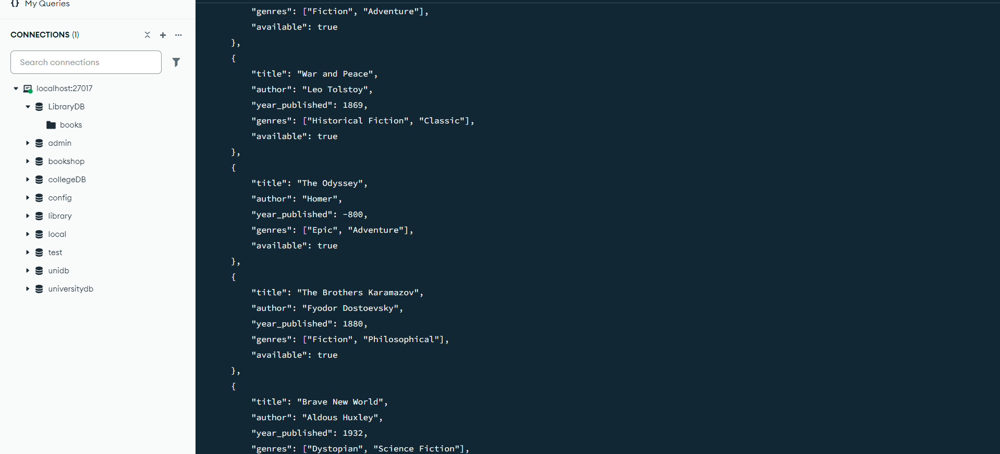
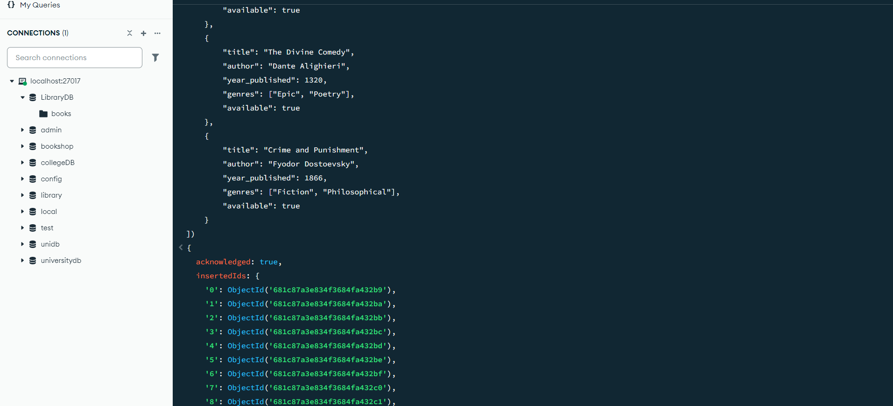
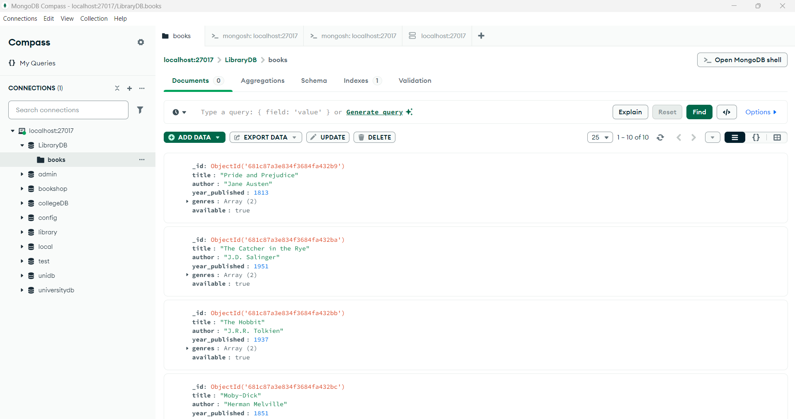
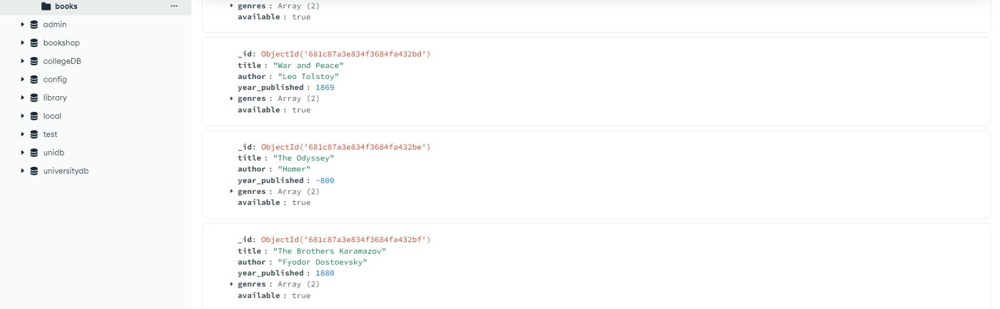

---

## 📚 3. Find All Books

```js
db.books.find()
```


---

## 📘 4. Find Books Published After 1950

```js
db.books.find({ year_published: { $gt: 1950 } })
```
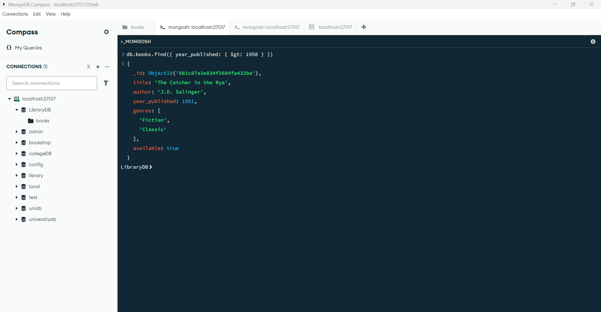
---

## 🔎 5. Find a Book by Title

```js
db.books.findOne({ title: "The Hobbit" })
```
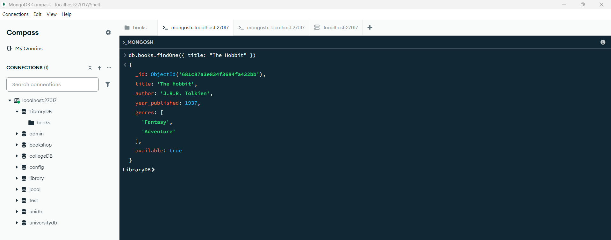
---

## 🔧 6. Update Year Published 

```js
db.books.updateOne(
    { title: "The Great Gatsby" },
    { $set: { year_published: 1925 } }
)
// No match – this book is not in the collection
```
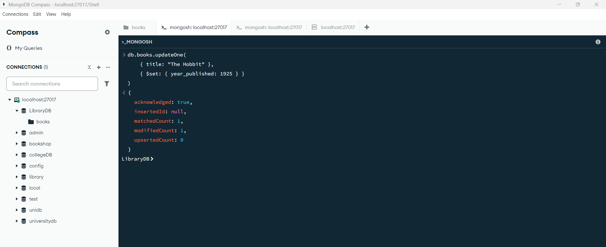
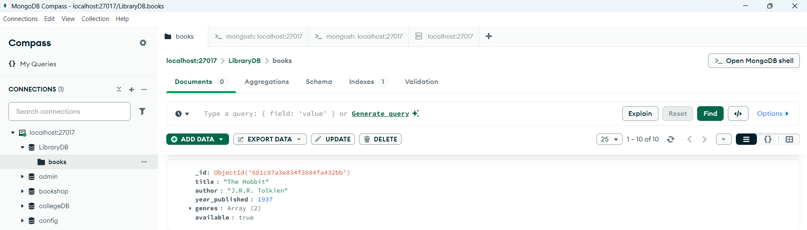 <br><br>
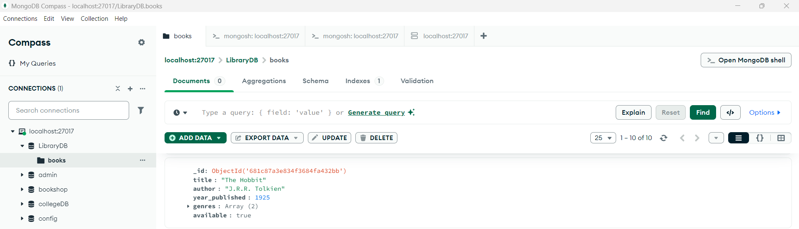
---

## 🔧 7. Set Available to False for "Moby-Dick"

```js
db.books.updateOne(
    { title: "Moby-Dick" },
    { $set: { available: false } }
)
```
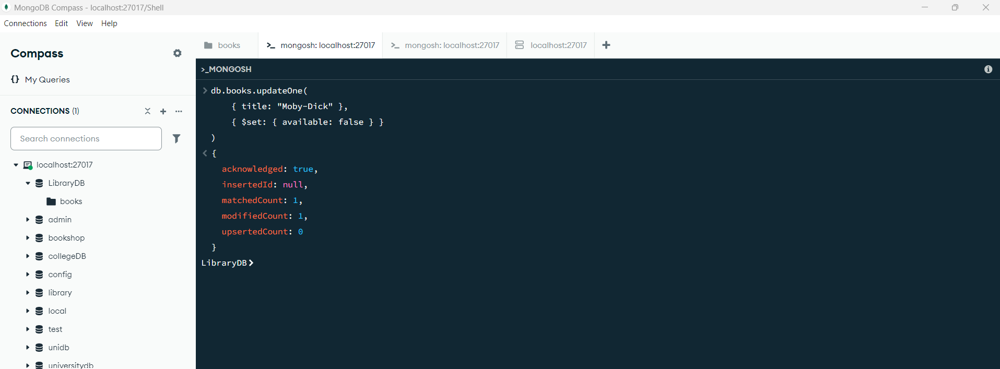
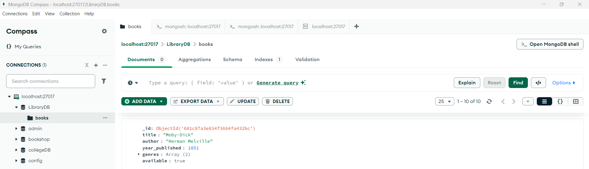 <br><br>

---

## 🔄 8. Add Field `checked_out: false` to Available Books

```js
db.books.updateMany(
    { available: true },
    { $set: { checked_out: false } }
)
```
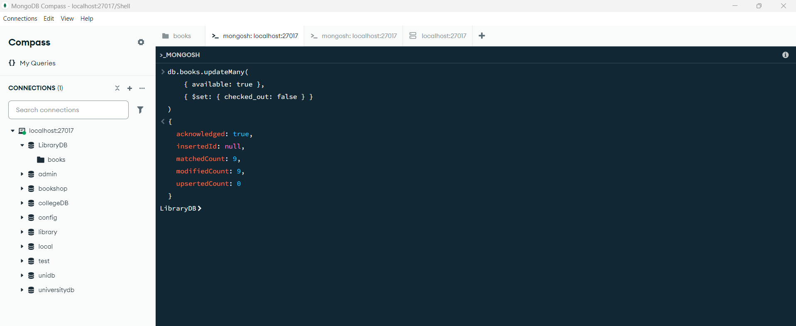

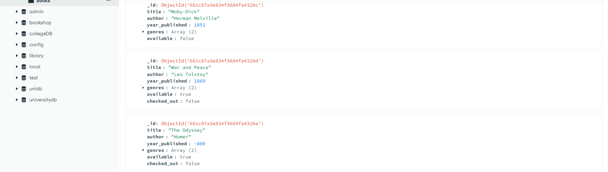
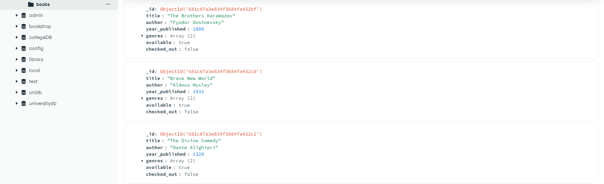


---

## 🔁 9. Set `checked_out: true` for Adventure Books

```js
db.books.updateMany(
    { genres: "Adventure" },
    { $set: { checked_out: true } }
)
```
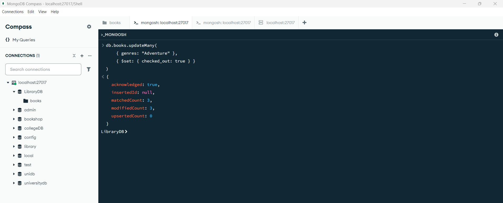
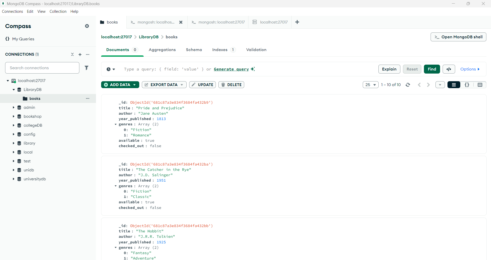
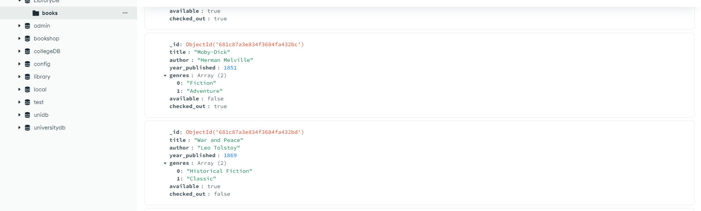
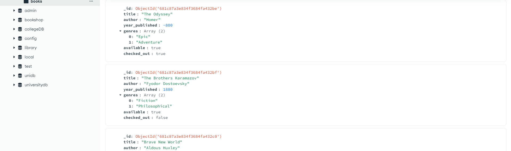
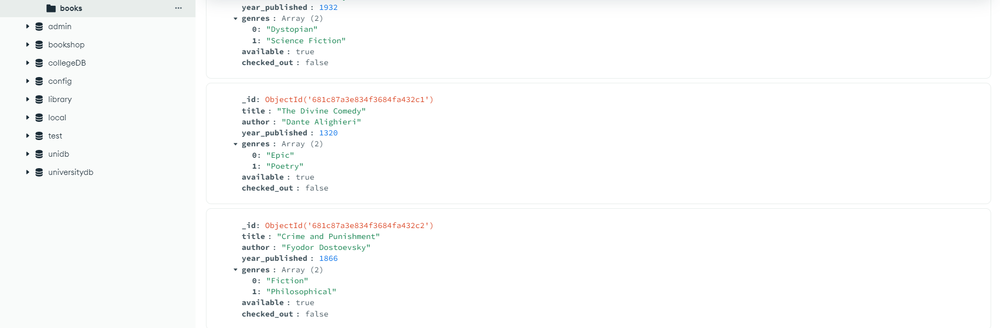

---

## 🗑 10. Delete a Book by Title

```js
db.books.deleteOne({ title: "The Odyssey" })
```
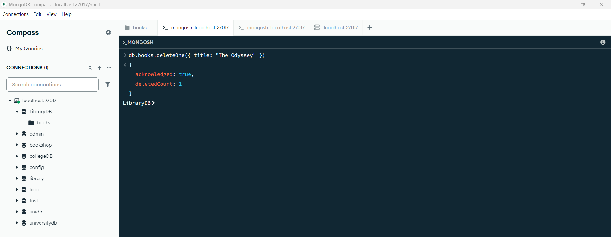
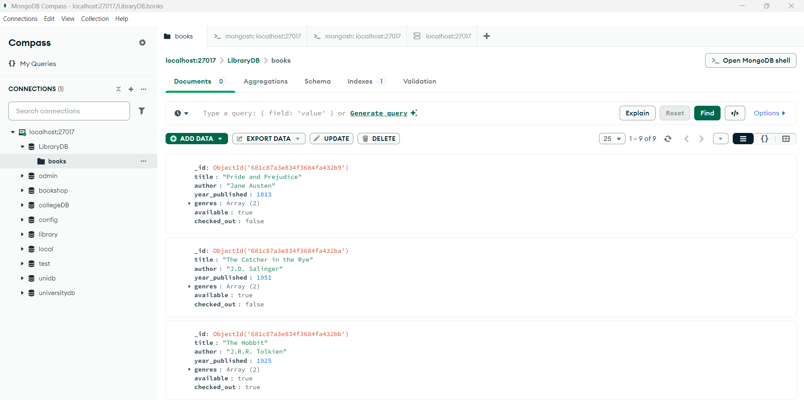
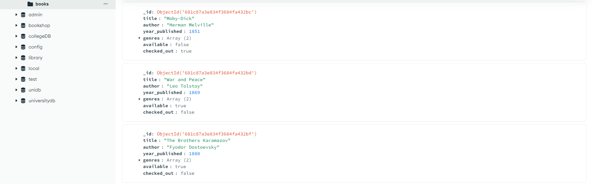
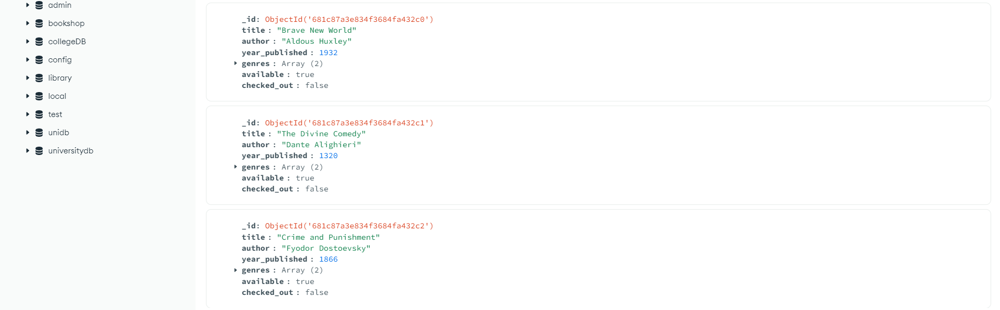

---

## 🧹 11. Delete All Books Published Before 1930

```js
db.books.deleteMany({ year_published: { $lt: 1930 } })
```
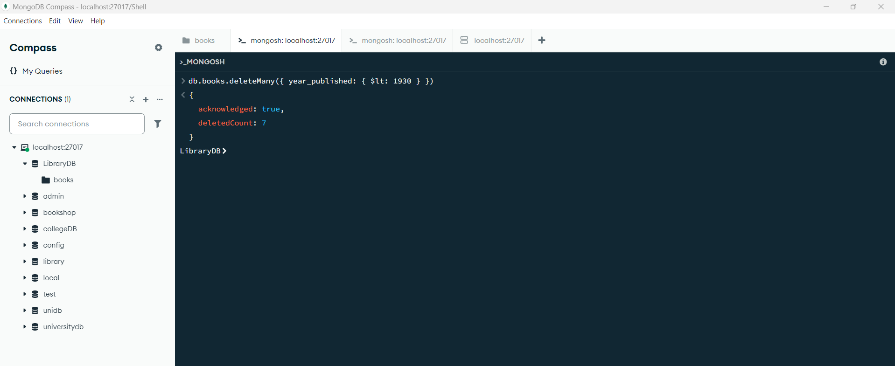
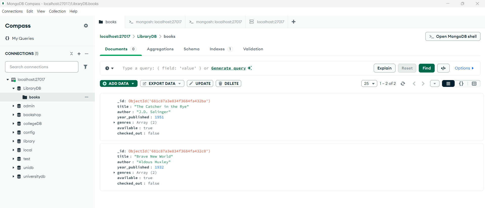 |

---

## ✅ Summary

- This example uses `insertMany`, `find`, `findOne`, `updateOne`, `updateMany`, `deleteOne`, and `deleteMany`.
- Designed to be run in MongoDB Shell, Compass, or a JavaScript MongoDB environment.

---

