# 📚 MongoDB Library System

This project demonstrates a MongoDB schema for a library system including libraries, books, and authors. It also provides various queries and aggregations to interact with the data.

---

## ✅ 1. Create and Use the Database

```js
use Library
```
---

## ✅ 2. Create Collections

```js
db.createCollection("libraries")
db.createCollection("books")
db.createCollection("authors")
```
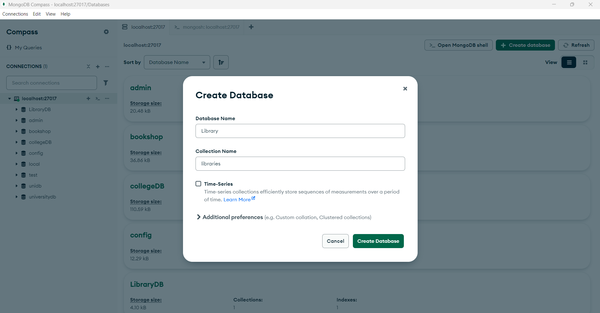
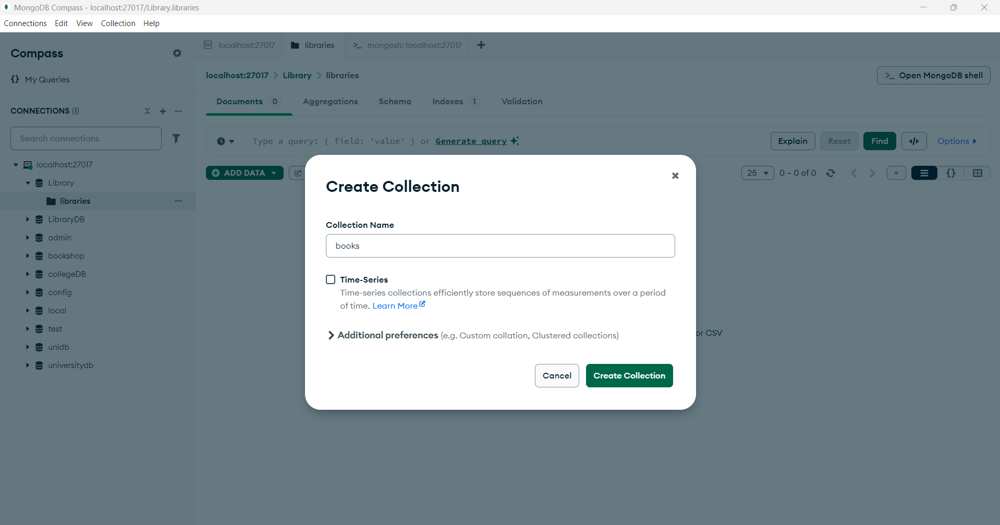
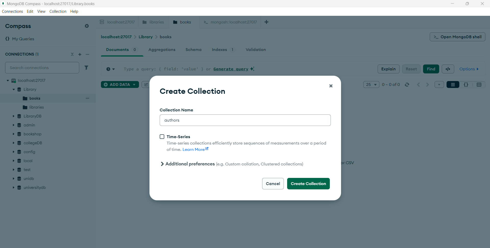
---

## ✅ 3. Insert Sample Documents

### 📁 Insert into `libraries`:

```js
db.libraries.insertMany([
  {
    _id: ObjectId("60d5fbb2f295f5e2c4d5a8a1"),
    name: "Central Library",
    location: "Downtown"
  },
  {
    _id: ObjectId("60d5fbb2f295f5e2c4d5a8a2"),
    name: "Westside Branch",
    location: "Westside"
  }
])
```

### 📚 Insert into `books`:

```js
db.books.insertMany([
  {
    _id: ObjectId("60d5fc5ef295f5e2c4d5a8a3"),
    title: "To Kill a Mockingbird",
    library_id: ObjectId("60d5fbb2f295f5e2c4d5a8a1"),
    author_ids: [ObjectId("60d5fd3ef295f5e2c4d5a8a4")]
  },
  {
    _id: ObjectId("60d5fc5ef295f5e2c4d5a8a5"),
    title: "1984",
    library_id: ObjectId("60d5fbb2f295f5e2c4d5a8a2"),
    author_ids: [ObjectId("60d5fd3ef295f5e2c4d5a8a6")]
  },
  {
    _id: ObjectId("60d5fc5ef295f5e2c4d5a8a7"),
    title: "Harry Potter and the Philosopher's Stone",
    library_id: ObjectId("60d5fbb2f295f5e2c4d5a8a1"),
    author_ids: [
      ObjectId("60d5fd3ef295f5e2c4d5a8a8"),
      ObjectId("60d5fd3ef295f5e2c4d5a8a9")
    ]
  }
])
```

### ✍️ Insert into `authors`:

```js
db.authors.insertMany([
  {
    _id: ObjectId("60d5fd3ef295f5e2c4d5a8a4"),
    name: "Harper Lee",
    birth_year: 1926
  },
  {
    _id: ObjectId("60d5fd3ef295f5e2c4d5a8a6"),
    name: "George Orwell",
    birth_year: 1903
  },
  {
    _id: ObjectId("60d5fd3ef295f5e2c4d5a8a8"),
    name: "J.K. Rowling",
    birth_year: 1965
  },
  {
    _id: ObjectId("60d5fd3ef295f5e2c4d5a8a9"),
    name: "John Tiffany",
    birth_year: 1971
  }
])
```
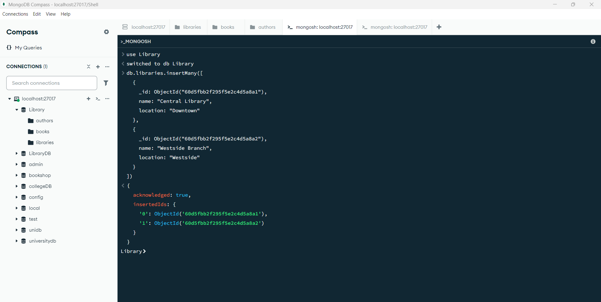
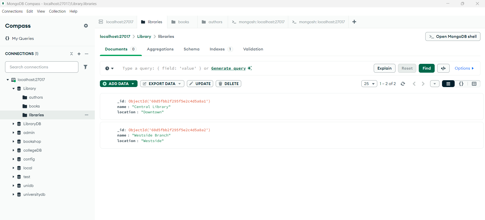

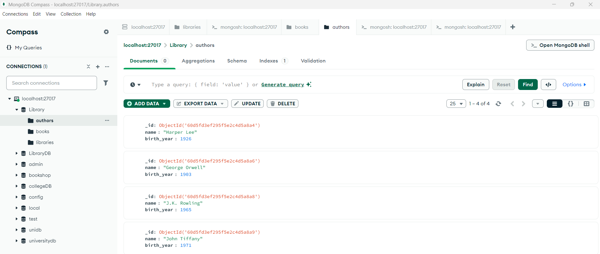
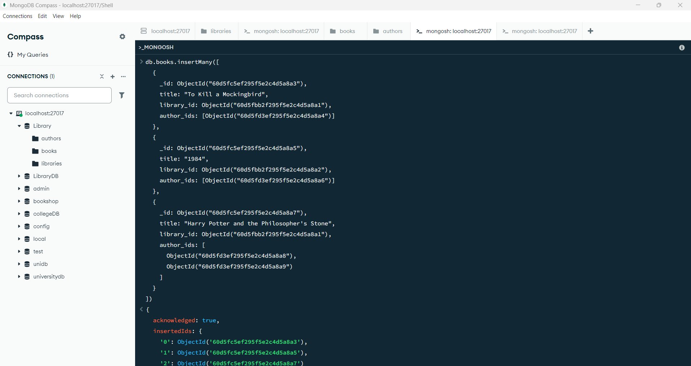
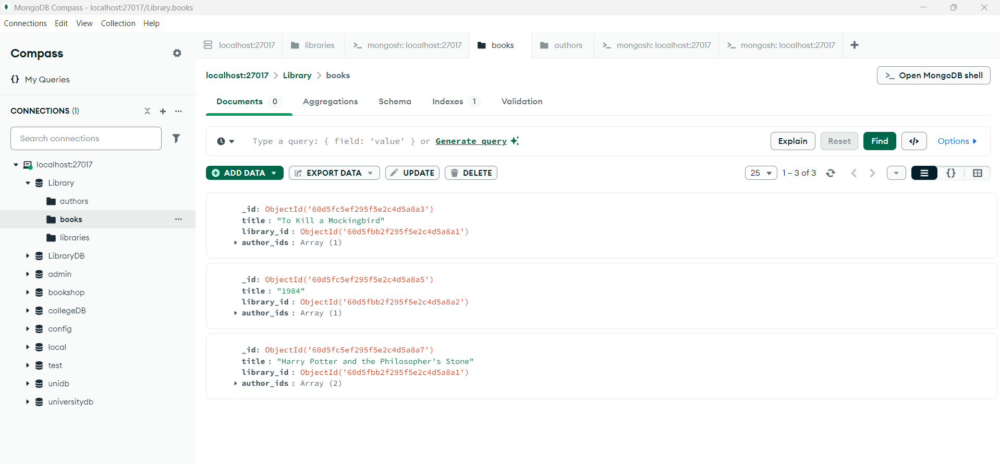

---

## ✅ 4. Find all books in the "Central Library"

```js
const centralLibrary = db.libraries.findOne({ name: "Central Library" })
db.books.find({ library_id: centralLibrary._id })
```
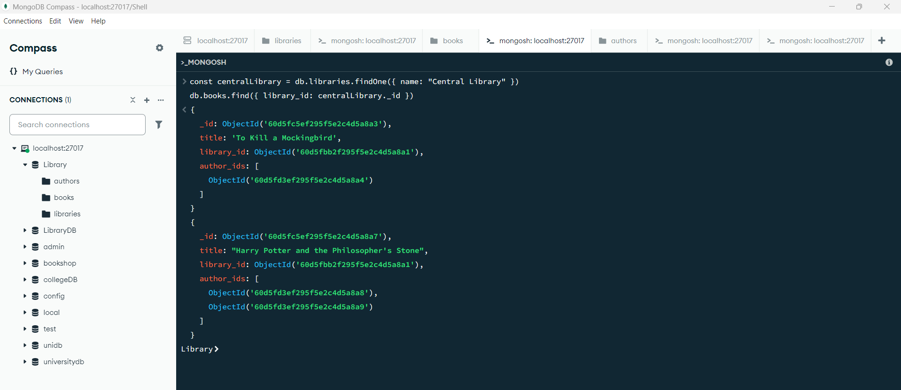

---

## ✅ 5. List all libraries along with the number of books they have

```js
db.books.aggregate([
  {
    $group: {
      _id: "$library_id",
      book_count: { $sum: 1 }
    }
  },
  {
    $lookup: {
      from: "libraries",
      localField: "_id",
      foreignField: "_id",
      as: "library"
    }
  },
  { $unwind: "$library" },
  {
    $project: {
      library_name: "$library.name",
      book_count: 1
    }
  }
])
```


---

## ✅ 6. Find all books written by "J.K. Rowling"

```js
const jkRowling = db.authors.findOne({ name: "J.K. Rowling" })
db.books.find({ author_ids: jkRowling._id })
```
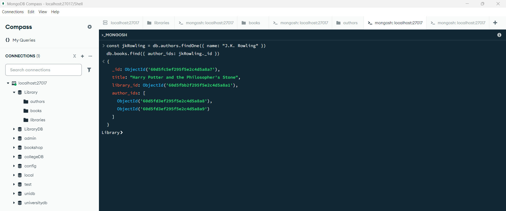

---

## ✅ 7. List all authors along with the books they have written

```js
db.authors.aggregate([
  {
    $lookup: {
      from: "books",
      localField: "_id",
      foreignField: "author_ids",
      as: "books"
    }
  },
  {
    $project: {
      name: 1,
      books: "$books.title"
    }
  }
])
```
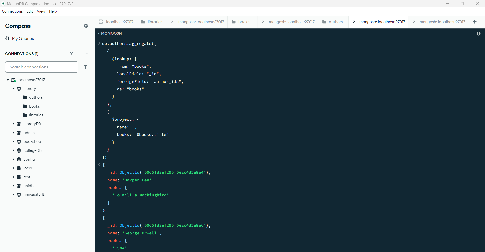
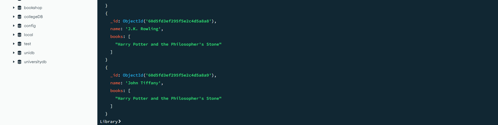

---

## ✅ 8. Find all books along with their authors' details

```js
db.books.aggregate([
  {
    $lookup: {
      from: "authors",
      localField: "author_ids",
      foreignField: "_id",
      as: "authors"
    }
  }
])
```
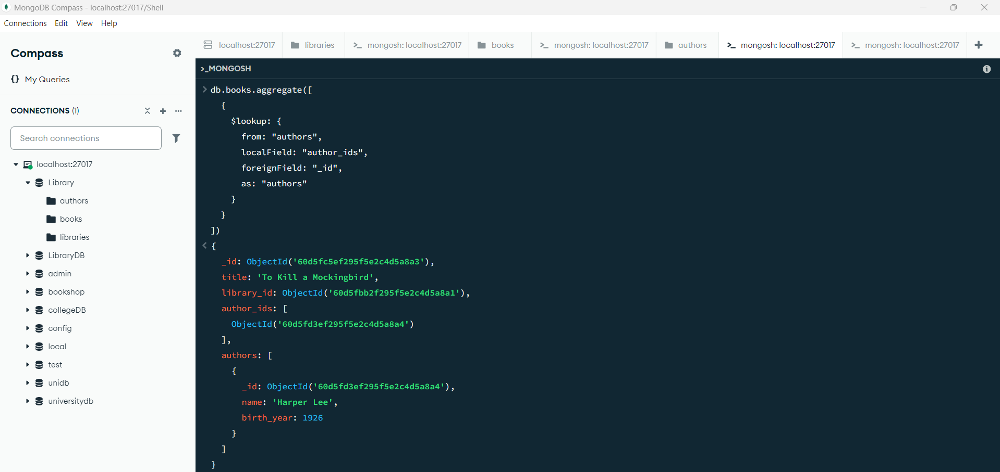
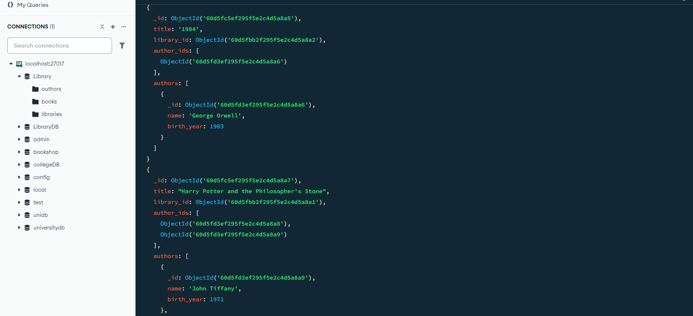 


---

## ✅ 9. List all libraries and the number of books they have (including those with none)

```js
db.libraries.aggregate([
  {
    $lookup: {
      from: "books",
      localField: "_id",
      foreignField: "library_id",
      as: "books"
    }
  },
  {
    $project: {
      name: 1,
      book_count: { $size: "$books" }
    }
  }
])
```
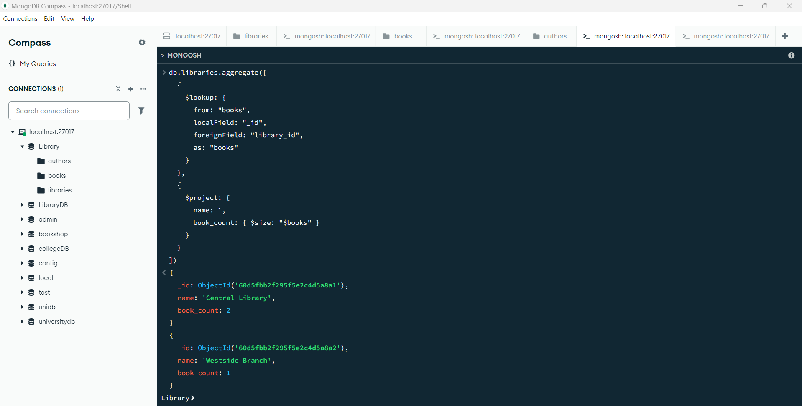

---

## ✅ 10. Calculate the average number of books per library

```js
db.books.aggregate([
  {
    $group: {
      _id: "$library_id",
      count: { $sum: 1 }
    }
  },
  {
    $group: {
      _id: null,
      avg_books: { $avg: "$count" }
    }
  }
])
```


---

## ✅ 11. Find all authors who have written more than one book

```js
db.books.aggregate([
  { $unwind: "$author_ids" },
  {
    $group: {
      _id: "$author_ids",
      count: { $sum: 1 }
    }
  },
  { $match: { count: { $gt: 1 } } },
  {
    $lookup: {
      from: "authors",
      localField: "_id",
      foreignField: "_id",
      as: "author"
    }
  },
  { $unwind: "$author" },
  {
    $project: {
      name: "$author.name",
      count: 1
    }
  }
])
```


---

## ✅ 12. Retrieve all books along with their authors' names and the library they belong to

```js
db.books.aggregate([
  {
    $lookup: {
      from: "authors",
      localField: "author_ids",
      foreignField: "_id",
      as: "authors"
    }
  },
  {
    $lookup: {
      from: "libraries",
      localField: "library_id",
      foreignField: "_id",
      as: "library"
    }
  },
  {
    $unwind: "$library"
  },
  {
    $project: {
      title: 1,
      authors: "$authors.name",
      library: "$library.name"
    }
  }
])
```
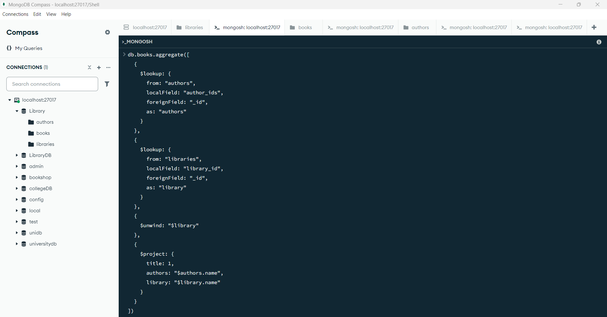
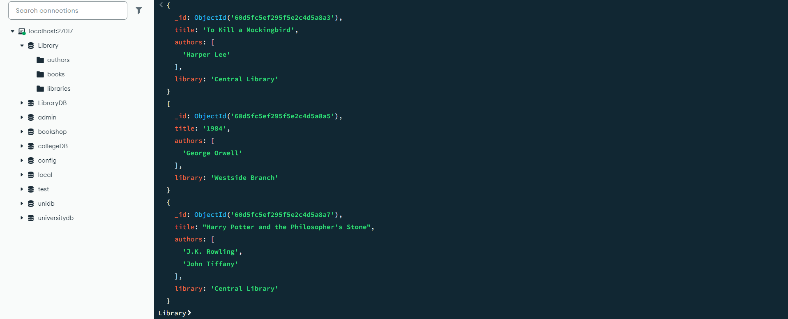

---

## ✅ 13. List all authors who have not written any books

```js
db.authors.aggregate([
  {
    $lookup: {
      from: "books",
      localField: "_id",
      foreignField: "author_ids",
      as: "books"
    }
  },
  {
    $match: {
      books: { $eq: [] }
    }
  },
  {
    $project: {
      name: 1
    }
  }
])
```
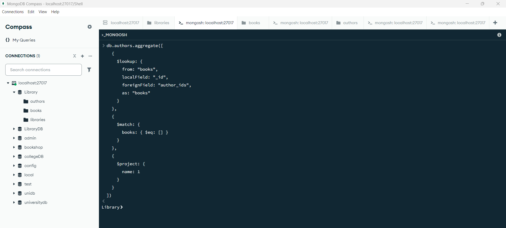

