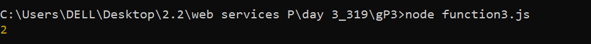
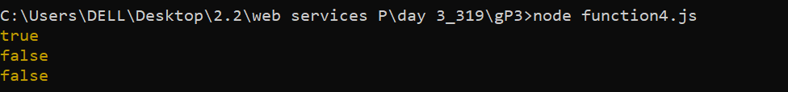
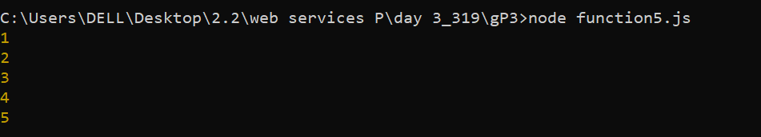
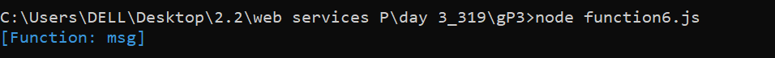
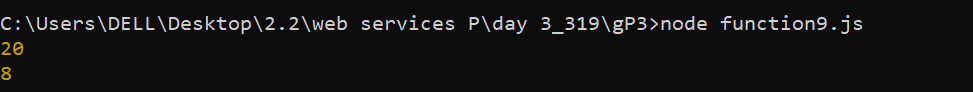
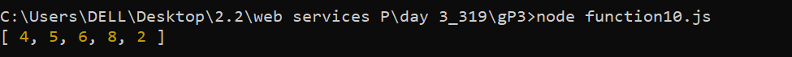
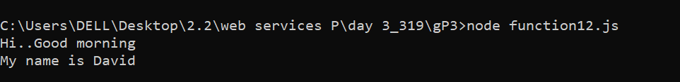
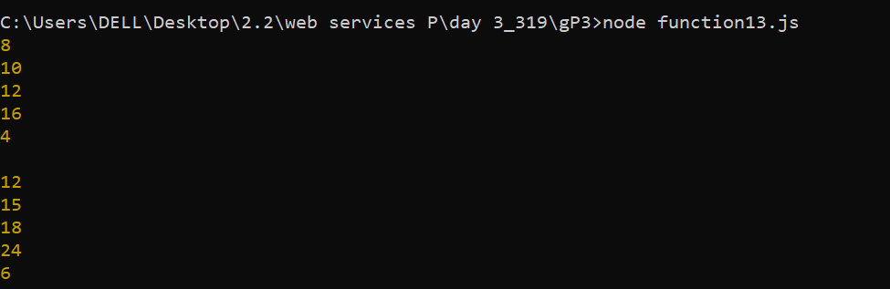

| Code Files | Outputs |
|-------------|---------|
|['function1.js'](./Codes/function1.js)||
|['function2.js'](./Codes/function2.js)||
|['function3.js'](./Codes/function3.js)||
|['function4.js'](./Codes/function4.js)||
|['function5.js'](./Codes/function5.js)||
|['function6.js'](./Codes/function6.js)||
|['function7.js'](./Codes/function7.js)||
|['function8.js'](./Codes/function8.js)||
|['function9.js'](./Codes/function9.js)||
|['function10.js'](./Codes/function10.js)||
|['function11.js'](./Codes/function11.js)||
|['function12.js'](./Codes/function12.js)||
|['function13.js'](./Codes/function13.js)||

