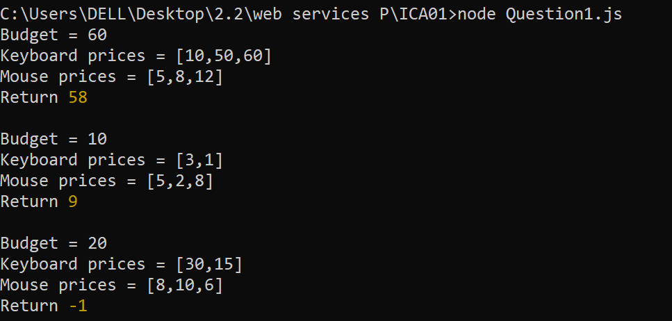
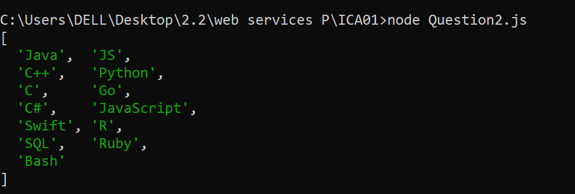
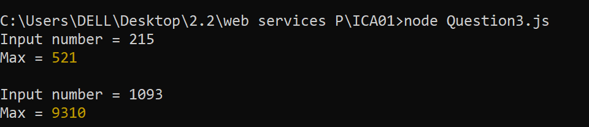
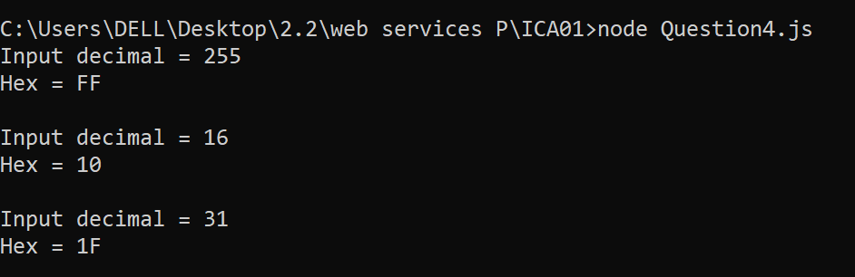

| Code Files | Outputs |
|------------|---------|
|['Question1.js'](./Codes/Question1.js)||
|['Question2.js'](./Codes/Question2.js)||
|['Question3.js'](./Codes/Question3.js)||
|['Question4.js'](./Codes/Question4.js)||
