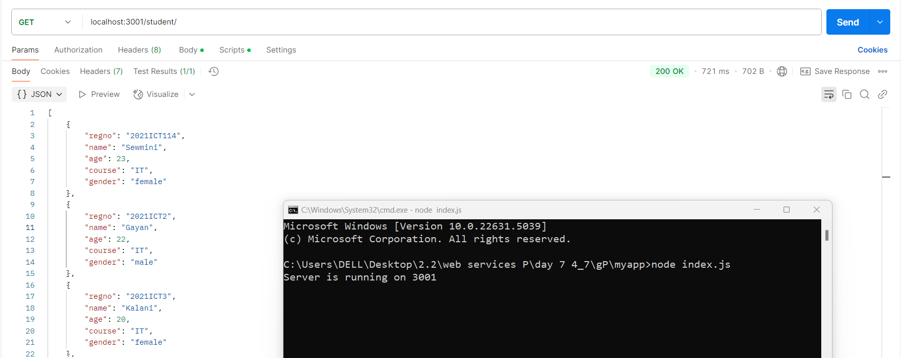
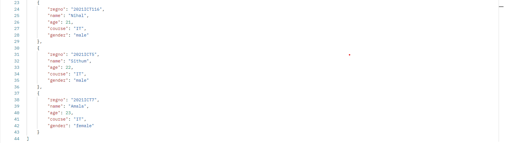
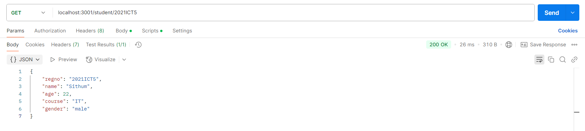
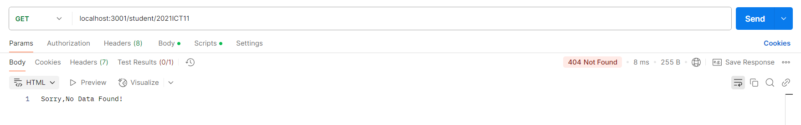
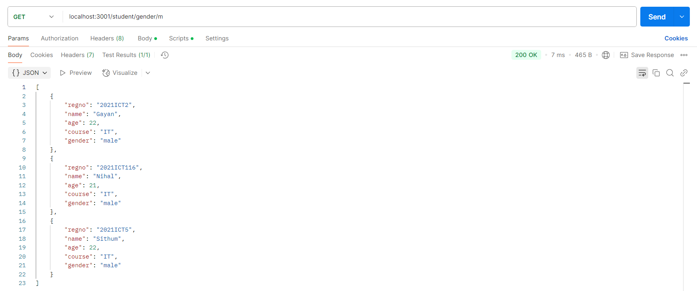

| Code Files | Outputs |
|------------|---------|
|['index.js'](index./Codes/.js)  ['studentroute.js'](./Codes/studentroute.js)  ['studentservice.js'](./Codes/studentservice.js)  ['studentdb.js'](./Codes/studentdb.js)  ['myapp.zip'](./Codes/myapp.zip)|        |
