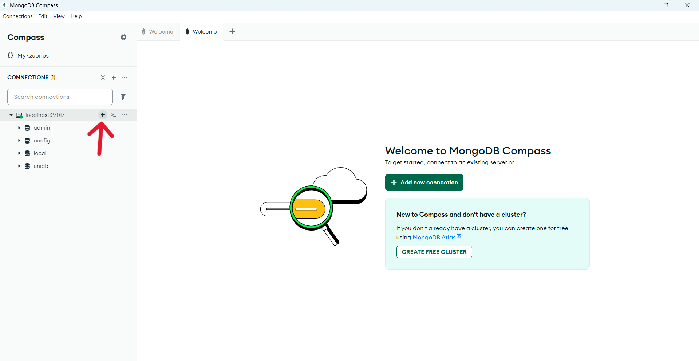
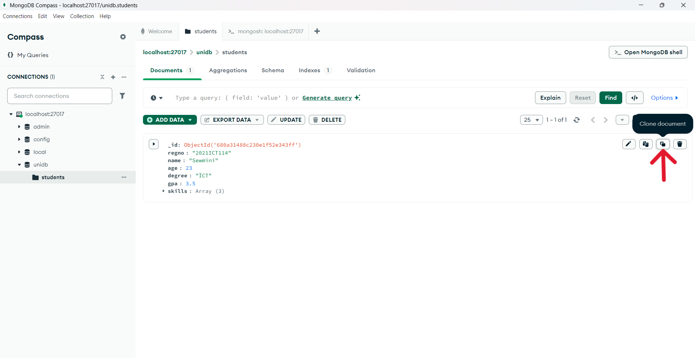
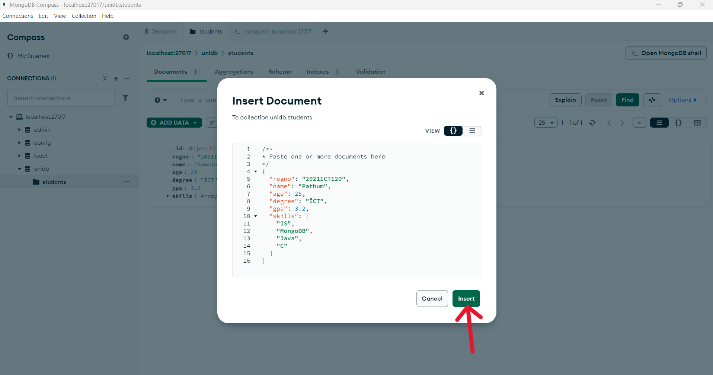
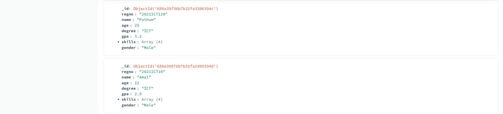

# $${\color{blue} {MongoDB \space Tutorial}}$$

               
## $${\color{red} Image 1: Add \space Connection}$$  
### Open MongoDB Compass → Click “Add new connection”.

## $${\color{red} Image 2: Enter \space Address}$$  
### Type mongodb://localhost:27017/ → Click “Save & Connect”.

## $${\color{red} Image 3: Connected \space to \space Server}$$  
### Connected successfully → Click “+” to make a database.

## $${\color{red} Image 4: Create \space Database}$$  
### Type unidb as database name, students as collection name → Click "Create Database".

## $${\color{red} Image 5: View \space Collection}$$  
### See students collection → Click "Open MongoDB shell".

## $${\color{red} Image 6: Basic \space Shell \space Commands}$$  
### 1. use unidb → Go to unidb database  
### 2. show databases → List all databases  
### 3. show collections → List collections inside a database  
### 4. use local → Switch to local database  
### 5. use unidb → Go back to unidb  

## $${\color{red} Image 7: Add \space Data}$$  
### Click "ADD DATA" to put documents inside students collection.

## $${\color{red} Image 8: Insert \space a \space New \space Document}$$  
### Click "Insert document" to add one student manually.

## $${\color{red} Image 9: Insert \space Document \space Window}$$  
### Screen appears → Ready to type student details.

## $${\color{red} Image 10: Fix \space Document \space Error}$$  
### If mistake → Click "Format Document" to fix structure.

## $${\color{red} Image 11: Save \space Correct \space Document}$$  
### Document corrected → Click "Insert" to save.

## $${\color{red} Image 12: Document \space Added}$$  
### First student record is saved successfully.

## $${\color{red} Image 13: Clone \space Existing \space Document}$$  
### Click Clone icon to copy an existing student.

## $${\color{red} Image 14: Insert \space Cloned \space Document}$$  
### Edit the cloned student → Click "Insert".

## $${\color{red} Image 15: Two \space Documents \space Shown}$$  
### Now you have 2 students in the collection.

## $${\color{red} Image 16: Shell \space and \space Copy \space Options}$$  
### 1. Open MongoDB shell → Write commands.  
### 2. Copy to clipboard → Copy document quickly.

## $${\color{red} Image 17: InsertOne \space Command}$$  
## Used insertOne() command in shell → Added one more student. 
db.students.insertOne({  
  "regno": "2021ICT120", 
  "name": "Pathum", 
  "age": 25, 
  "degree": "ICT", 
  "gpa": 3.2, 
  "skills": [ 
    "JS", 
    "MongoDB", 
    "Java", 
    "C" 
  ] 
} 
) 

## $${\color{red} Image 18: Refresh \space to \space See \space Changes}$$  
### Click refresh → New student appears.

## $${\color{red} Image 19: Edit \space Existing \space Document}$$  
### Click "Edit" to update student's information.

## $${\color{red} Image 20: Add \space New \space Field}$$  
### Add a new field after age (example: gender).

## $${\color{red} Image 21: Gender \space Field \space Added}$$  
### Field gender: "Male" added to student.

## $${\color{red} Image 22: Changes \space Saved}$$  
### Changes saved → New field visible.

## $${\color{red} Image 23: InsertMany \space Command}$$  
### Used insertMany() in shell → Added multiple students together.
db.students.insertMany( 
[ 
{ 
  "regno": "2021ICT10", 
  "name": "Amal", 
  "age": 22, 
  "degree": "ÏCT", 
  "gpa": 2.9, 
  "skills": [ 
    "JS", 
    "MongoDB", 
    "Java", 
    "C" 
  ], 
  "gender": "Male" 
}, 
{ 
  "regno": "2021ICT10", 
  "name": "Kamala", 
  "age": 24, 
  "degree": "ÏCT", 
  "gpa": 3.1, 
  "skills": [ 
    "JS", 
    "MongoDB", 
    "Java", 
    "C#" 
  ], 
  "gender": "Female" 
} 
] 
) 

## $${\color{red} Image 24: View \space Students}$$  
### All students shown inside students collection.

## $${\color{red} Image 25: Use \space Options \space Button}$$  
### Click "Options" to filter, sort, or project data.

## $${\color{red} Image 26: Set \space Query \space Options}$$  
### Options available: Project, Sort, Collation, Skip, Limit.

## $${\color{red} Image 27: Project \space Only \space Name \space and \space Age}$$  
### Set projection → {name:1, age:1} → Click "Find". 
{name:1, age:1}

## $${\color{red} Image 28: Only \space Name \space and \space Age \space Shown}$$  
### Result shows only name and age fields.

## $${\color{red} Image 29: Project \space without \space _id}$$  
### Set projection → {name:1, age:1, _id:0} → Hide _id field. 
{name:1, age:1, _id:0}

## $${\color{red} Image 30: Result: \space Only \space Name \space and \space Age}$$  
### See only name and age without _id.

## $${\color{red} Image 31: Reset \space Query}$$  
### Click "Reset" to remove projection.

## $${\color{red} Image 32: Show \space All \space Fields}$$  
### See all fields (no filter applied).

## $${\color{red} Image 33: Filter \space One \space Student}$$  
### Find a specific student by setting a condition. 
{regno:”2021ICT114”}

## $${\color{red} Image 34: Filter \space by \space Gender}$$  
### Find students by gender field. 
{gender:”Male”}

## $${\color{red} Image 35: Find \space Females}$$  
### Find only students with gender: "Female". 
{gender:”Female”}

## $${\color{red} Image 36: Shell \space Find \space Females}$$  
### Shell command to find female students. 
db.students.find({ gender: "Female" })

## $${\color{red} Image 37: Shell \space Find \space Males}$$  
### Shell command to find male students. 
db.students.findOne({ gender: "Male" })

## $${\color{red} Image 38: Find \space Students \space Older \space Than \space 22}$$  
### Find students where age > 22. 
{ age: { $gt: 22 } }

## $${\color{red} Image 39: List \space Students >22}$$  
### Example: Students aged 23 and 25. 
db.students.find({ age: { $gt: 22 } })

## $${\color{red} Image 40: Find \space Students \space Younger \space Than \space 23}$$  
### Find students where age < 23. 
{age:{$lt:23}}

## $${\color{red} Image 41: Students <23 \space Years \space Old}$$  
### List of students younger than 23. 
db.students.find({ age: { $lt: 23 } })

## $${\color{red} Image 42: Find \space Students \space Aged \space 23}$$  
### Find students where age = 23. 
{age:{$eq:23}}

## $${\color{red} Image 43: Shell \space Find \space Age \space 23}$$  
### Shell command → Find students aged 23. 
db.students.find({ age: { $eq: 23 } })

## $${\color{red} Image 44: Find \space Students \space Skilled \space in \space "JS"}$$  
### Find students who know "JS". 
{ skills: "JS" }

## $${\color{red} Image 45: Shell \space Find \space "JS" \space Skill}$$  
### Shell command → Find students with "JS" skill. 
db.students.find({ skills: "JS" })

## $${\color{red} Image 46: Find \space Students \space Skilled \space in \space "C"}$$  
### Find students who know "C". 
{ skills: {$in:["C"]} }

## $${\color{red} Image 47: Exclude \space "C" \space Skill}$$  
### Find students who don't know "C". 
{skills:{$nin:[“C”]}}

## $${\color{red} Image 48: Find \space Skills \space "C" \space or \space "C"}$$  
### Find students who know "C" or "C#". 
{ skills: {$in:["C"],[“C#”]} }

## $${\color{red} Image 49: Sort \space by \space GPA \space Low \space to \space High}$$  
### Sort students by GPA ascending (low to high). 
{gpa:1}

## $${\color{red} Image 50: Find \space ICT \space Students \space Sorted \space by \space GPA}$$  
### Find ICT students → GPA sorted ascending. 
db.students.find({ degree: "ICT" }).sort({ gpa: 1 })

## $${\color{red} Image 51: Sort \space by \space GPA \space High \space to \space Low}$$  
### Sort students by GPA descending (highest to lowest). 
{gpa:-1}

## $${\color{red} Image 52: ICT \space Students \space Sorted \space High \space to \space Low}$$  
### Find ICT students → GPA highest first. 
db.students.find({ degree: "ICT" }).sort({ gpa: -1 })

## $${\color{red} Image 53: Male \space Students \space Sorted \space by \space GPA}$$  
### Find gender:"Male" students → Sort GPA ascending. 
{gender:”Male”}  
{gpa:1}

## $${\color{red} Image 54: ICT \space + \space Male \space Students \space by \space GPA}$$  
### Find students who are both ICT and Male → Sort GPA ascending. 
db.students.find({ degree: "ICT", gender: "Male" }).sort({ gpa: 1 })

## $${\color{red} Image 55: Find \space All \space Students + \space Sort \space by \space GPA}$$  
### Find all students → Sort GPA from lowest to highest. 
db.students.find().sort({ gpa: 1 })

## $${\color{red} Image 56: Find \space All \space Students}$$  
### Find all students → No limit or skip applied → Display all documents. 
{name: 1 , regno: 1 , _id: 0} 
{gpa: 1}

## $${\color{red} Image 57: Find \space Limited \space Students}$$  
### Find students → Limit result to 3 students → Show only first 3 documents. 
{name:1 , regno:1 , _id:0} 
{name:1}

## $${\color{red} Image 58: Find \space Students \space with \space Skip \space and \space Limit}$$  
### Skip 1 student → Then find next 3 students → Display 3 documents after skipping the first one. 
{name:1 , regno:1 , _id:0} 
{name:1}

