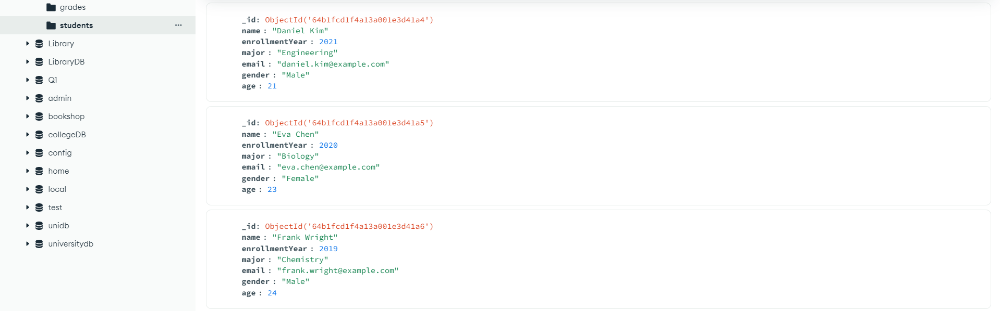

# 🎓 MongoDB Students and Grades Project

---

## 📁 Project Structure

```
mongodb-students-grades/
├── README.md
├── insert_students_and_grades.js
├── queries/
│   ├── find_female_students.js
│   ├── find_young_students.js
│   ├── find_alice_grades.js
│   ├── count_math_students.js
│   ├── students_fall2022_grades.js
└── screenshots/
    └── *.png (Screenshots of collection table views and outputs)
```

---

### 🔧1. Create the students and grades collections and insert the sample documents into both collections.

```js
use University;

// Insert students
db.students.insertMany([
  {
    _id: ObjectId("64b1fcd1f4a13a001e3d41a1"),
    name: "Alice Johnson",
    enrollmentYear: 2021,
    major: "Computer Science",
    email: "alice.johnson@example.com",
    gender: "Female",
    age: 20
  },
  {
    _id: ObjectId("64b1fcd1f4a13a001e3d41a2"),
    name: "Bob Smith",
    enrollmentYear: 2020,
    major: "Mathematics",
    email: "bob.smith@example.com",
    gender: "Male",
    age: 22
  },
  {
    _id: ObjectId("64b1fcd1f4a13a001e3d41a3"),
    name: "Clara Lee",
    enrollmentYear: 2022,
    major: "Physics",
    email: "clara.lee@example.com",
    gender: "Female",
    age: 19
  },
  {
    _id: ObjectId("64b1fcd1f4a13a001e3d41a4"),
    name: "Daniel Kim",
    enrollmentYear: 2021,
    major: "Engineering",
    email: "daniel.kim@example.com",
    gender: "Male",
    age: 21
  },
  {
    _id: ObjectId("64b1fcd1f4a13a001e3d41a5"),
    name: "Eva Chen",
    enrollmentYear: 2020,
    major: "Biology",
    email: "eva.chen@example.com",
    gender: "Female",
    age: 23
  },
  {
    _id: ObjectId("64b1fcd1f4a13a001e3d41a6"),
    name: "Frank Wright",
    enrollmentYear: 2019,
    major: "Chemistry",
    email: "frank.wright@example.com",
    gender: "Male",
    age: 24
  },
  {
    _id: ObjectId("64b1fcd1f4a13a001e3d41a7"),
    name: "Grace Liu",
    enrollmentYear: 2022,
    major: "Economics",
    email: "grace.liu@example.com",
    gender: "Female",
    age: 20
  },
  {
    _id: ObjectId("64b1fcd1f4a13a001e3d41a8"),
    name: "Henry Davis",
    enrollmentYear: 2021,
    major: "Philosophy",
    email: "henry.davis@example.com",
    gender: "Male",
    age: 22
  },
  {
    _id: ObjectId("64b1fcd1f4a13a001e3d41a9"),
    name: "Ivy Zhang",
    enrollmentYear: 2020,
    major: "Statistics",
    email: "ivy.zhang@example.com",
    gender: "Female",
    age: 21
  },
  {
    _id: ObjectId("64b1fcd1f4a13a001e3d41aa"),
    name: "Jack Lee",
    enrollmentYear: 2023,
    major: "Business",
    email: "jack.lee@example.com",
    gender: "Male",
    age: 18
  }
]);

// Insert grades
db.grades.insertMany([
  { subject: "Mathematics", score: 85, term: "Fall 2022", studentId: ObjectId("64b1fcd1f4a13a001e3d41a1") },
  { subject: "English", score: 90, term: "Fall 2022", studentId: ObjectId("64b1fcd1f4a13a001e3d41a1") },

  { subject: "Mathematics", score: 75, term: "Spring 2022", studentId: ObjectId("64b1fcd1f4a13a001e3d41a2") },
  { subject: "Statistics", score: 80, term: "Fall 2022", studentId: ObjectId("64b1fcd1f4a13a001e3d41a2") },

  { subject: "Physics", score: 92, term: "Fall 2022", studentId: ObjectId("64b1fcd1f4a13a001e3d41a3") },
  { subject: "Mathematics", score: 86, term: "Spring 2023", studentId: ObjectId("64b1fcd1f4a13a001e3d41a3") },

  { subject: "Engineering", score: 89, term: "Fall 2021", studentId: ObjectId("64b1fcd1f4a13a001e3d41a4") },
  { subject: "Mathematics", score: 84, term: "Spring 2022", studentId: ObjectId("64b1fcd1f4a13a001e3d41a4") },

  { subject: "Biology", score: 78, term: "Spring 2021", studentId: ObjectId("64b1fcd1f4a13a001e3d41a5") },
  { subject: "Chemistry", score: 82, term: "Fall 2021", studentId: ObjectId("64b1fcd1f4a13a001e3d41a5") },

  { subject: "Chemistry", score: 88, term: "Fall 2021", studentId: ObjectId("64b1fcd1f4a13a001e3d41a6") },
  { subject: "Physics", score: 79, term: "Spring 2022", studentId: ObjectId("64b1fcd1f4a13a001e3d41a6") },

  { subject: "Economics", score: 83, term: "Spring 2023", studentId: ObjectId("64b1fcd1f4a13a001e3d41a7") },
  { subject: "English", score: 89, term: "Fall 2022", studentId: ObjectId("64b1fcd1f4a13a001e3d41a7") },

  { subject: "Philosophy", score: 91, term: "Fall 2022", studentId: ObjectId("64b1fcd1f4a13a001e3d41a8") },
  { subject: "History", score: 77, term: "Spring 2023", studentId: ObjectId("64b1fcd1f4a13a001e3d41a8") },

  { subject: "Statistics", score: 79, term: "Spring 2022", studentId: ObjectId("64b1fcd1f4a13a001e3d41a9") },
  { subject: "Data Science", score: 88, term: "Fall 2022", studentId: ObjectId("64b1fcd1f4a13a001e3d41a9") },

  { subject: "Business", score: 87, term: "Fall 2023", studentId: ObjectId("64b1fcd1f4a13a001e3d41aa") },
  { subject: "Finance", score: 82, term: "Spring 2024", studentId: ObjectId("64b1fcd1f4a13a001e3d41aa") }
]);

```
<br><br><br><br><br><br><br><br><br><br><br><br><br><br><br><br>
---

### 📊 2. Show both collections in table view. 

In MongoDB Compass:
- Navigate to the `University` database
- View `students` and `grades` collections

<br><br>
---

### 👩‍🎓 3. Find the female students and only display their name, age and gender.

```js
db.students.find(
  { gender: "Female" },
  { _id: 0, name: 1, age: 1, gender: 1 }
)
```

---

### 👶 4. Find the students who are younger than 22 and enrolled after 2020.

```js
db.students.find(
  { age: { $lt: 22 }, enrollmentYear: { $gt: 2020 } }
)
```
<br>
---

### 📘 5. Find all grades for "Alice Johnson".

**Option 1 (with `findOne`)**

```js
const alice = db.students.findOne({ name: "Alice Johnson" });
db.grades.find({ studentId: alice._id });
```

**Option 2 (using `$lookup`)**

```js
db.students.aggregate([
  { $match: { name: "Alice Johnson" } },
  {
    $lookup: {
      from: "grades",
      localField: "_id",
      foreignField: "studentId",
      as: "grades"
    }
  },
  {
    $project: {
      _id: 0,
      name: 1,
      grades: 1
    }
  }
])
```
<br><br>
---

### ➕ 6. Find how many students followed the subject “Mathematics”.

**Option 1: countDocuments**

```js
db.grades.countDocuments({ subject: "Mathematics" })
```

**Option 2: Aggregate & count distinct students**

```js
db.grades.aggregate([
  { $match: { subject: "Mathematics" } },
  { $group: { _id: "$studentId" } },
  { $count: "studentCount" }
])
```

**Option 3: Using `distinct`**

```js
db.grades.distinct("studentId", { subject: "Mathematics" }).length
```
<br><br>
---

### 🍂 7. Find all students with grades in the term "Fall 2022". 

```js
db.grades.aggregate([
  { $match: { term: "Fall 2022" } },
  {
    $lookup: {
      from: "students",
      localField: "studentId",
      foreignField: "_id",
      as: "student"
    }
  },
  { $unwind: "$student" },
  {
    $project: {
      _id: 0,
      studentName: "$student.name",
      subject: 1,
      score: 1,
      term: 1
    }
  }
])
```
<br><br> 
---

