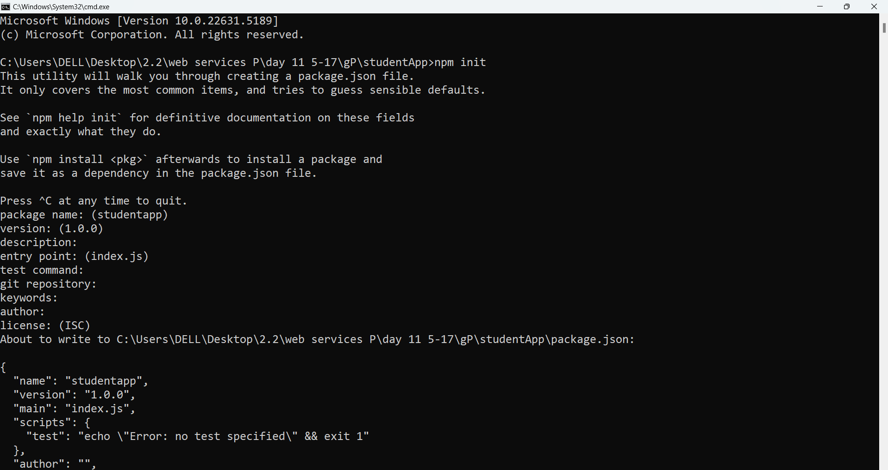
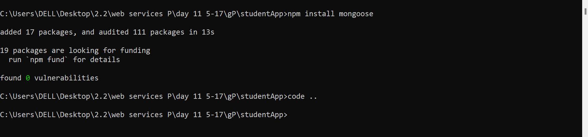
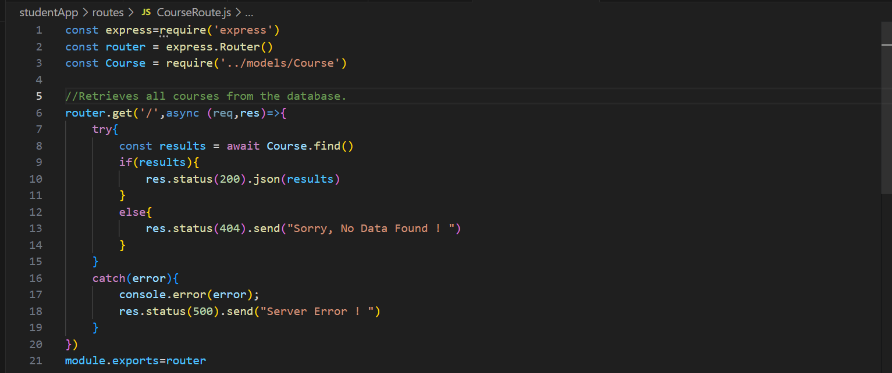
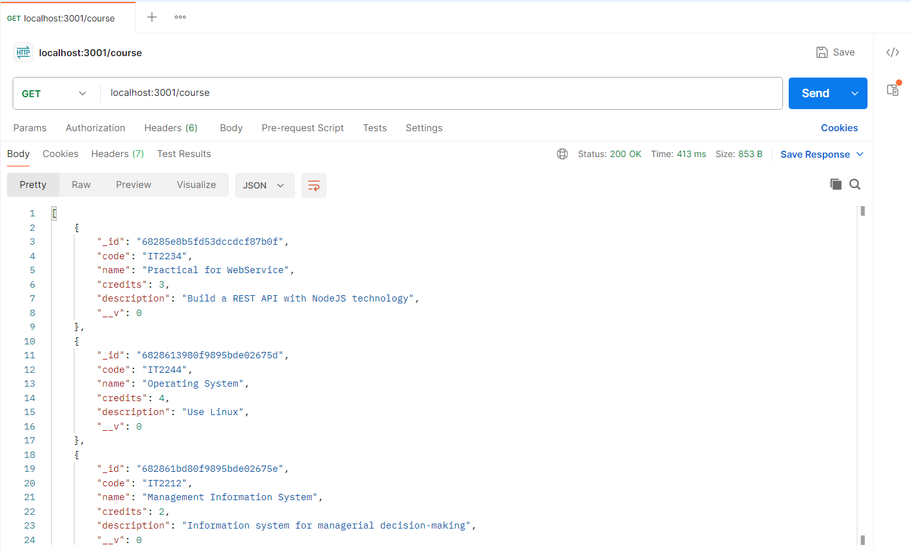
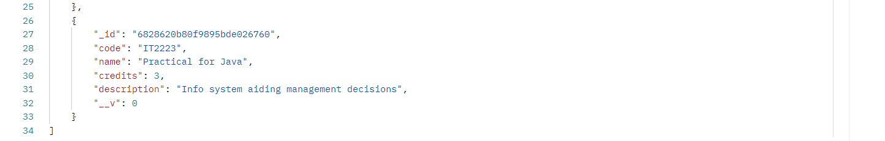
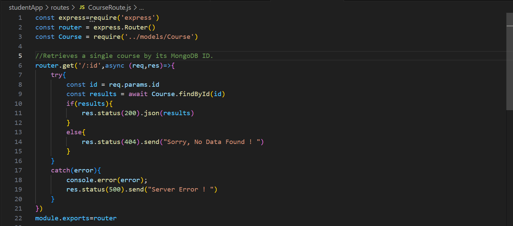
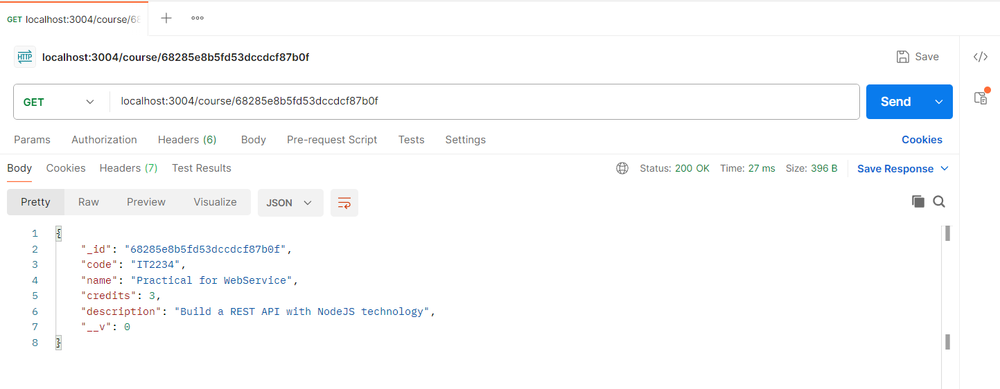
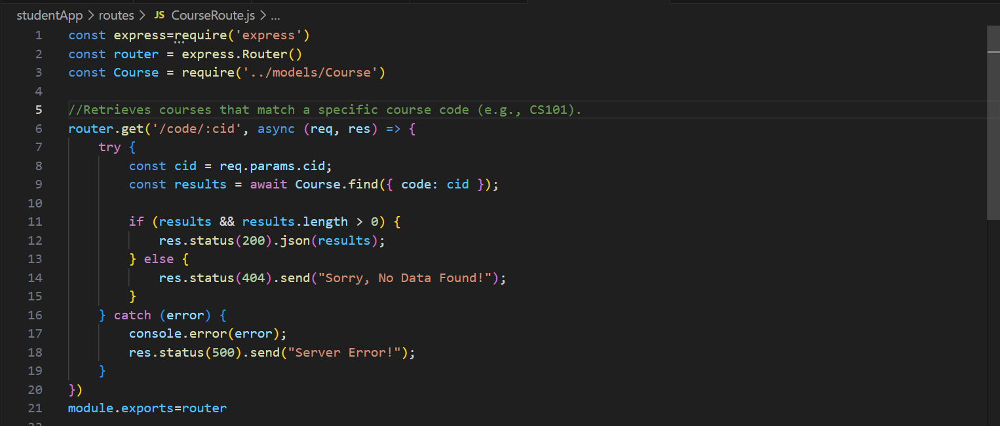
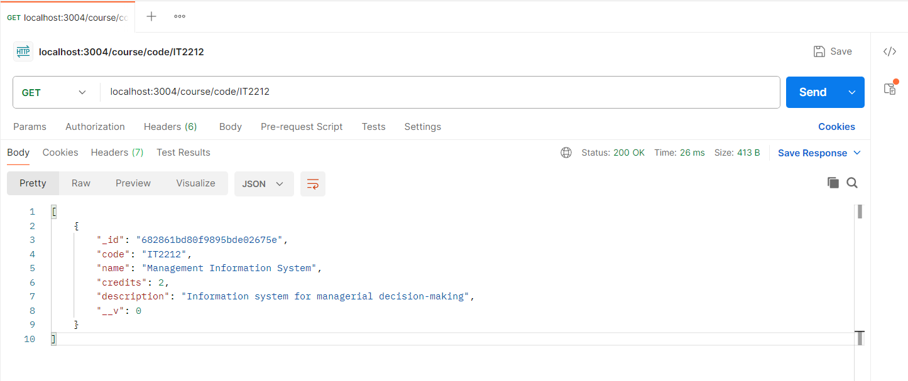

# 📘 StudentApp

A beginner-friendly Node.js application setup that leverages **Express.js**, **Mongoose**, and **Nodemon**. This project serves as a foundation for developing RESTful APIs connected to MongoDB.

---

## 📁 Project Setup Instructions

### 🔹 Step 1: Initialize the Project

Run the following command to create a `package.json` file, which holds metadata and dependencies for the project:

```bash
npm init
```

Follow the prompts or press Enter to accept default values. This creates the initial structure and configuration.

---

### 🔹 Step 2: Install Required Packages

#### ✅ Express
Used to set up the web server and routing.

```bash
npm install express
```

#### ✅ Nodemon
Used in development to automatically restart the server on file changes.

```bash
npm install nodemon
```

#### ✅ Mongoose
Used to interact with MongoDB using an object-oriented approach.

```bash
npm install mongoose
```
<br><br>
--

### 1. **GET /** – Fetch All Courses
- **Description**: Retrieves all courses from the database.
- **Response**: Returns an array of course objects or a 404 message if none found.

```bash
📫 Postman Example
GET http://localhost:3000/api/courses
```
<br><br>
--
```

### 2. **GET /:id** – Fetch Course by ID
- **Description**: Retrieves a single course using its MongoDB `_id`.
- **Response**: Returns the course object or a 404 message if not found.

```bash
📫 Postman Example
GET http://localhost:3000/api/courses/648a1234567890abcd123456
```
<br>
--
```

### 3. **GET /code/:cid** – Fetch Course by Code
- **Description**: Retrieves all courses matching a specific course `code` (e.g., CS101).
- **Response**: Returns matched course(s) or a 404 message if none found.

```bash
📫 Postman Example
GET http://localhost:3000/api/courses/648a1234567890abcd123456
```
<br>
--
```

