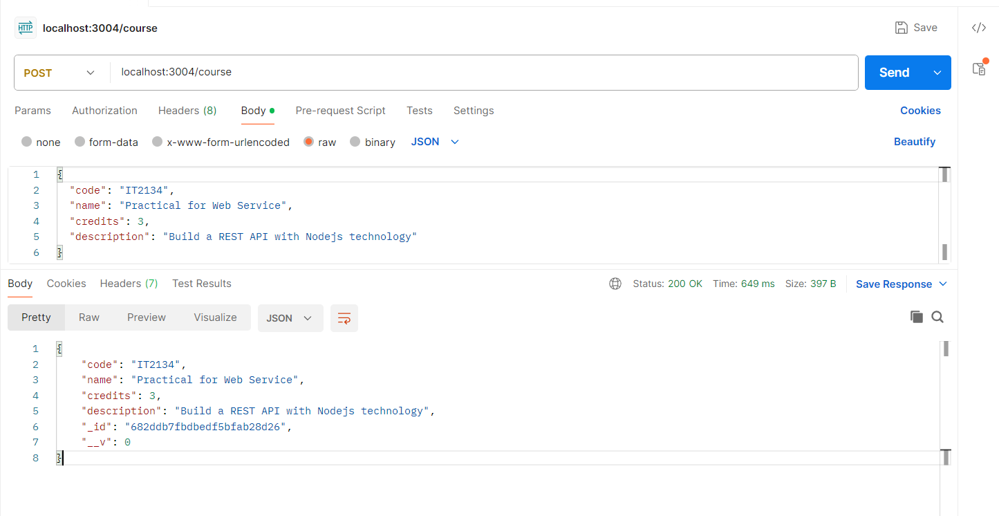
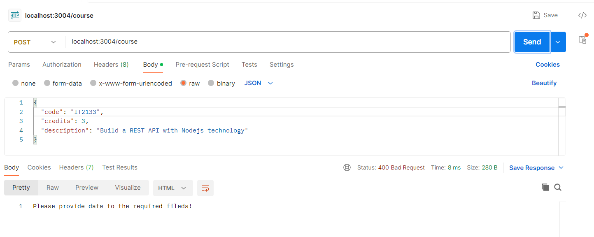
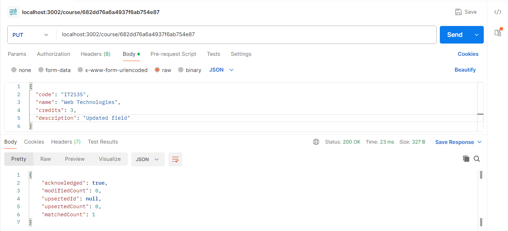
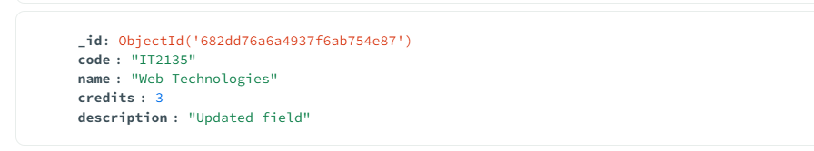
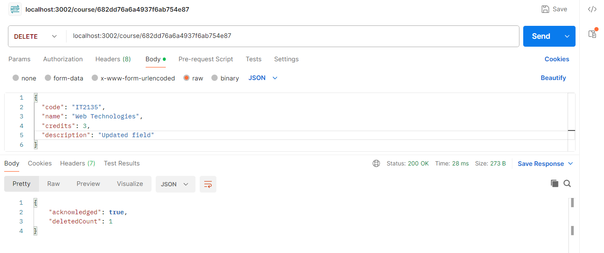

# 📘 StudentApp

---
## ➕ Insert a Course

**Description:**  Adds a new course to the database.

🖥️ Postman Setup:
POST /localhost:3001/course

 
---

---
## 📝 Update a Course

**Description:**
Updates a course using its MongoDB ObjectId.

🖥️ Postman Setup:
PUT /localhost:3002/Course/682dd76a6a4937f6ab754e87

 
---

---
## ❌ Delete a Course

**Description:**
 Deletes a course by its MongoDB ObjectId.

 🖥️ Postman Setup:
DELETE /localhost:3002/course/682dd76a6a4937f6ab754e87

---

