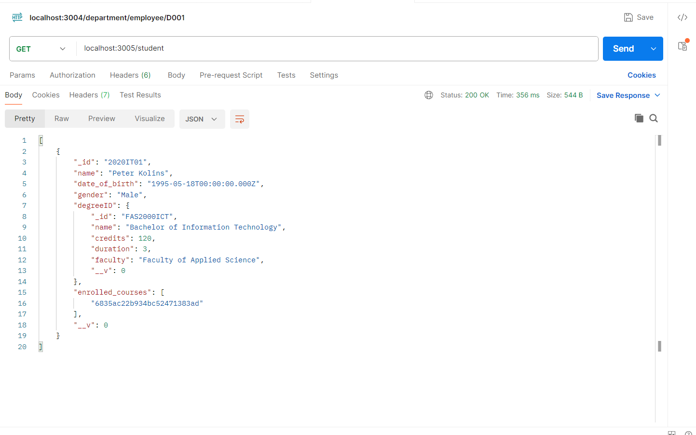

# 📚 Student Management API with MongoDB and Mongoose

This project demonstrates a simple student management system using **MongoDB** and **Mongoose** in a **Node.js** environment. It includes the schema design for student documents and shows how to insert sample student data with relationships to degrees and courses.

## 🛠 Technologies Used

- Node.js
- MongoDB
- Mongoose ODM
- Postman (for API testing)

## 📄 Schema Definition

The `Student` schema includes the following fields:

```js
const studentSchema = new mongoose.Schema({
  _id: { type: String, required: true },
  name: { type: String, required: true },
  date_of_birth: { type: Date },
  gender: { type: String },
  degreeID: { type: String, required: true, ref: 'degrees' },
  enrolled_courses: [{ type: mongoose.Types.ObjectId, ref: 'courses' }]
});
```

## 📥 Sample Student Document

```js
const Kolins = new Student({
  _id: '2020IT01',
  name: 'Peter Kolins',
  date_of_birth: '1995-05-18',
  gender: 'Male',
  degreeID: 'FAS2000ICT',
  enrolled_courses: ['68334a7746c5920f4ff2167d']
});
```

## 📸 Sample API Response (GET `/student`)

```json
{
  "_id": "2020IT01",
  "name": "Peter Kolins",
  "date_of_birth": "1995-05-18T00:00:00.000Z",
  "gender": "Male",
  "degreeID": {
    "_id": "FAS2000ICT",
    "name": "Bachelor of Information Technology",
    "credits": 120,
    "duration": 3,
    "faculty": "Faculty of Applied Science"
  },
  "enrolled_courses": ["6835ac22b934bc52471383ad"]
}
```
---

---
## ✅ How to Use

1. Clone the repo and install dependencies.
2. Connect to your MongoDB instance.
3. Run the server and use Postman to test `/student` API endpoints.
