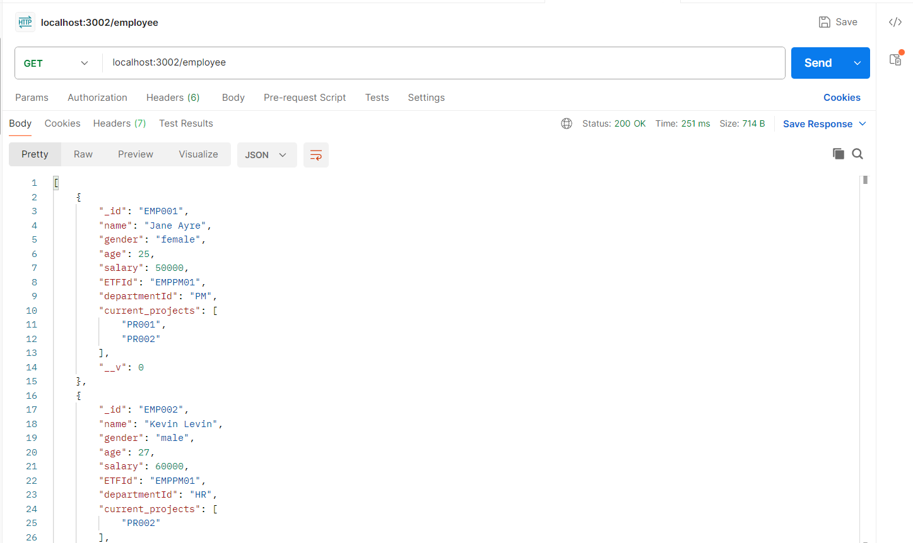
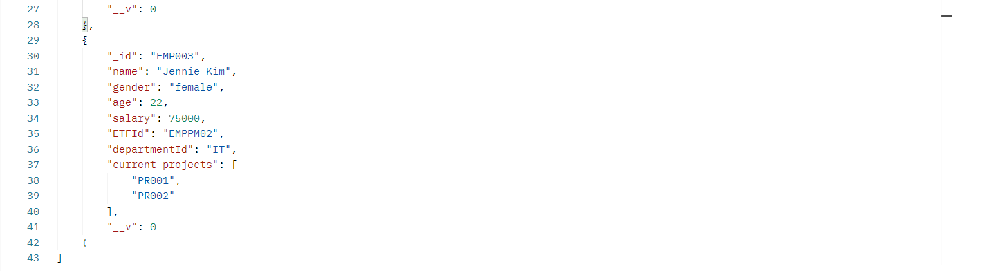
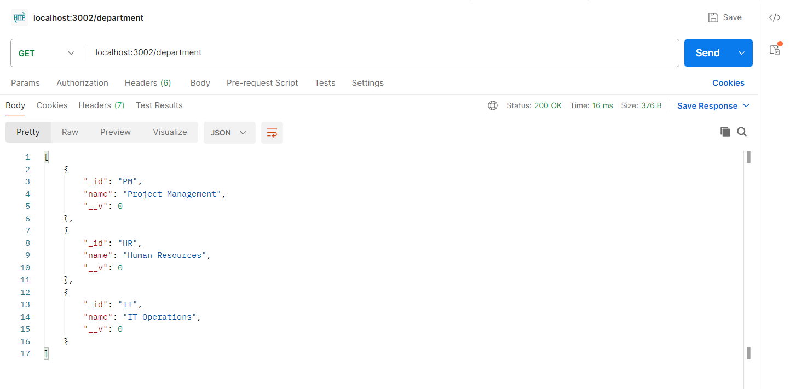
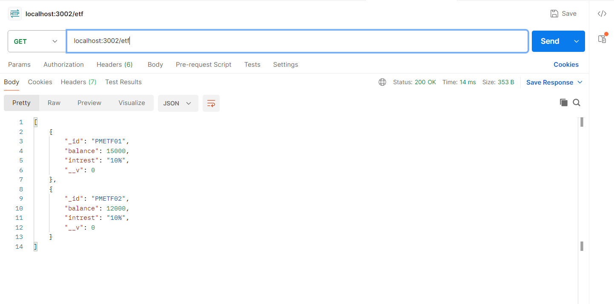
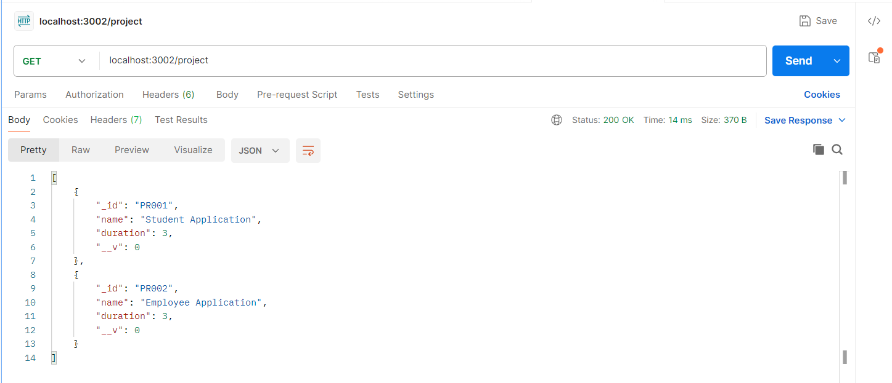
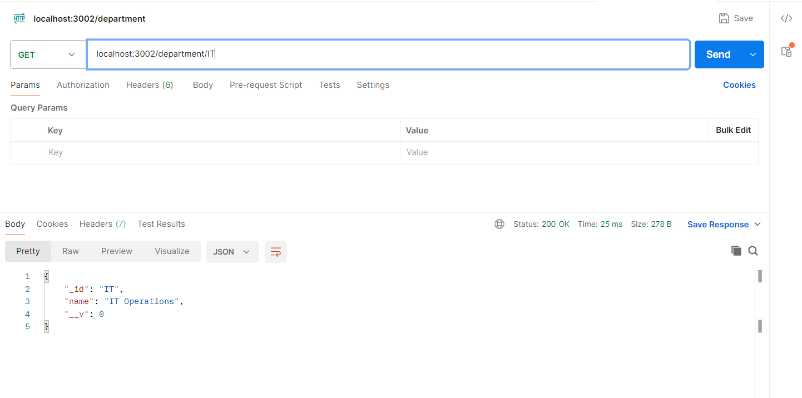
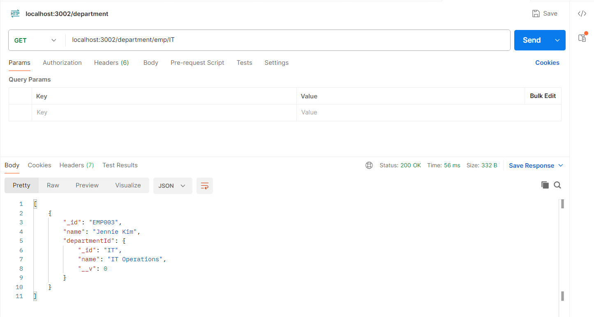
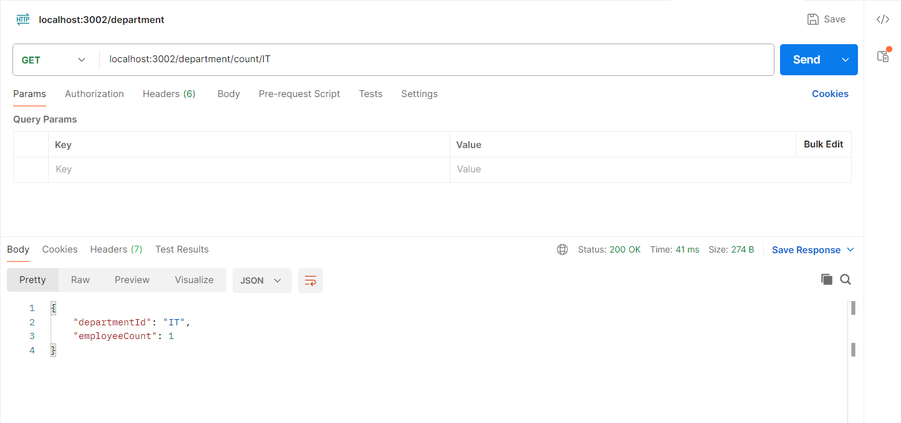
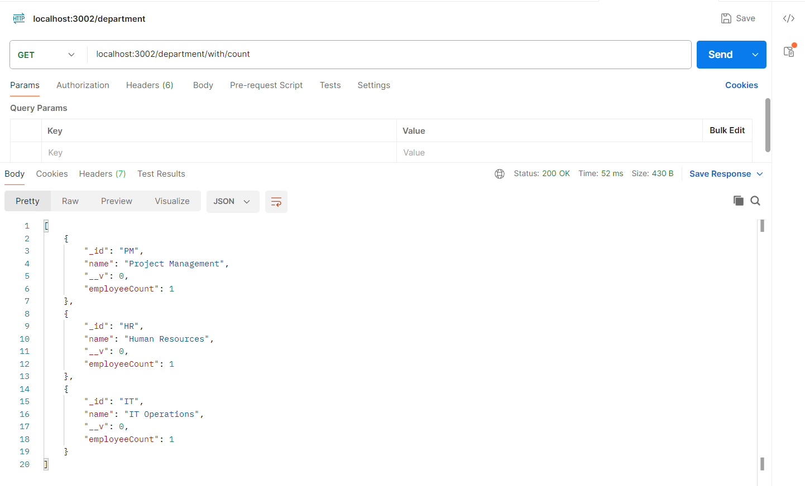

# 🚀 MongoDB Department-Employee API
A simple API built with MongoDB to manage:

📂 Departments

👩‍💼 Employees

💰 ETFs

🏗️ Projects

This README guides you through inserting data, creating relationships, and accessing endpoints using Postman.

## 1️⃣ 📂👩‍💼💰🏗️ Get All Departments, Employees, ETF, Projects
✅ Returns a list of all Departments, Employees, ETF, Projects Details.

    
---

## 2️⃣ 🆔📂 Get Department by ID
✅ Replace :id with the department's ObjectId.

---

## 3️⃣ 👥📂 Get Employees in a Department
✅ Returns all employees with the matching departmentId.

---

## 4️⃣ 🔢👩‍💼 Get Number of Employees in One Department
✅ Count how many employees belong to one department.

---

## 5️⃣ 📊📂 Show Employee Count per Department
✅ Uses aggregation to group and count employees per department.

---

