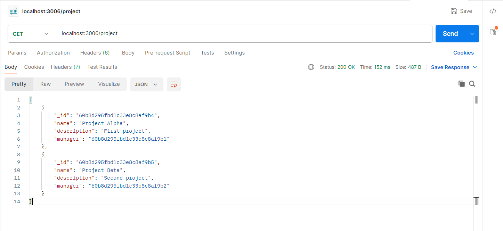
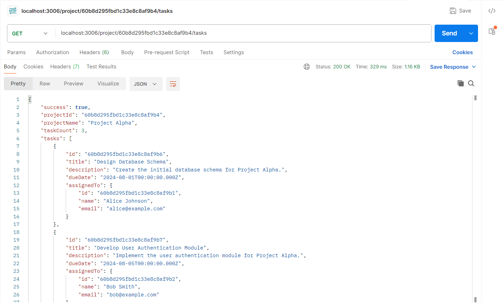
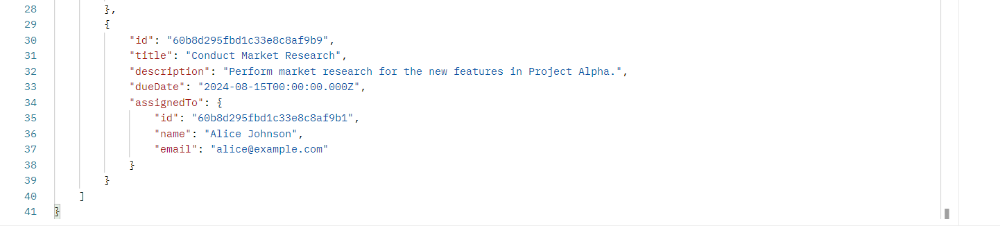
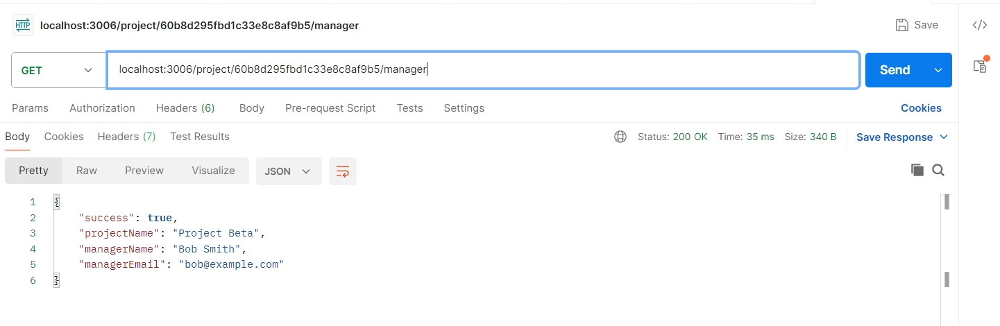
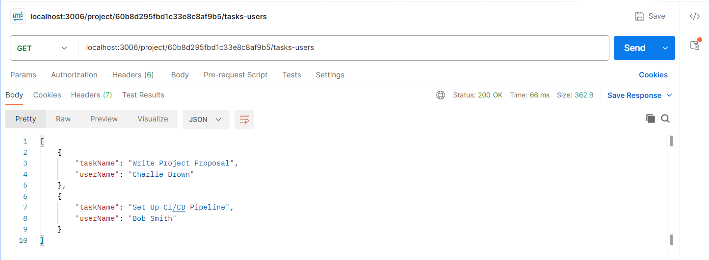

## 📁 Project Summary: Task and Project Management API

This project is a **Node.js-based backend API** designed for managing users, projects, and tasks. It is structured using the **MVC (Model-View-Controller)** design pattern and leverages **MongoDB** for database operations using **Mongoose**.

### 📌 Key Components

* **`index.js`**
  Main entry point of the application. Sets up the Express server and connects to the MongoDB database.

* **`models/`**
  Contains Mongoose schema definitions:

  * `User.js` – Defines user attributes and schema.
  * `Task.js` – Defines task-related fields (e.g. title, description, project ID).
  * `Project.js` – Defines project schema with relationships to tasks and users.

* **`middlewares/`**
  Contains custom middleware:

  * `errorHandler.js` – Global error handler for Express routes.

* **`package.json` & `package-lock.json`**
  Lists project dependencies such as `express`, `mongoose`, and possibly `nodemon` for development.

* **`node_modules/`**
  Installed packages required for running the application.

### 🔧 Features

* CRUD operations for Users, Tasks, and Projects.
* Centralized error handling.
* Scalable folder structure ready for route integration and controller logic.
* Suitable for academic or starter-level project management systems.

### 🛠️ Technologies Used

* Node.js
* Express.js
* MongoDB
* Mongoose
---

Based on your description and the expected implementation of the four API endpoints, here’s a **summary** that you can include in your GitHub `README.md`:

---

### 1. 🔁 Retrieve All Data (Reusable Functionality)

**Endpoint**: `/all-data` (example)

* Fetches and returns all documents from:

  * `User` collection
  * `Project` collection
  * `Task` collection
* **Reusable approach**: Uses a common function to fetch data from any model.
  

---

### 2. 📋 Get Tasks for a Project

**Endpoint**: `GET /project/{projectId}/tasks`

* Returns all **tasks** associated with a specific **project ID**.
* Leverages `Task.find({ project: projectId })`.
 
  
---

### 3. 👨‍💼 Get Project Manager Info

**Endpoint**: `GET /project/{projectId}/manager`

* Returns:

  * **Project name**
  * **Manager’s name**
  * **Manager’s email**
* Uses population or reference resolution from the `Project` model.
 

---

### 4. 🔗 Get Tasks and Assigned Users

**Endpoint**: `GET /project/{projectId}/tasks-users`

* Returns a list of:

  * **Task names**
  * **Assigned user names**
* Uses Mongoose population or aggregation to join task and user data efficiently.
 

---

