# 📚 Library Management RESTful API – ICAE 03 Practical (IT2234)
## ⚙️ Technologies Used

- **Node.js & Express** – For building RESTful APIs  
- **MongoDB & Mongoose** – For database and object modeling  
- **MongoDB Compass** – GUI to view and manage data  
- **VS Code** – Development environment  
- **Postman** – For API testing  

---

## 📁 Project Structure

project-root/ 
│ 
├── models/ // Mongoose schemas 
│ ├── Book.js 
│ ├── Student.js 
│ └── Borrow.js 
│ 
├── routes/ // Route handlers 
│ ├── bookRoutes.js 
│ ├── studentRoutes.js 
│ └── borrowRoutes.js 
│ 
├── app.js / server.js 
├── .env // MongoDB connection URL 
└── README.md 

---

## ✅ Task Overview & Simple Explanation

### 1️⃣ Map Models & Insert Data

- Created three Mongoose models: **Student**, **Book**, and **Borrow**
- Inserted the provided sample data into MongoDB using Compass
- Verified collections and data through **table view**
  
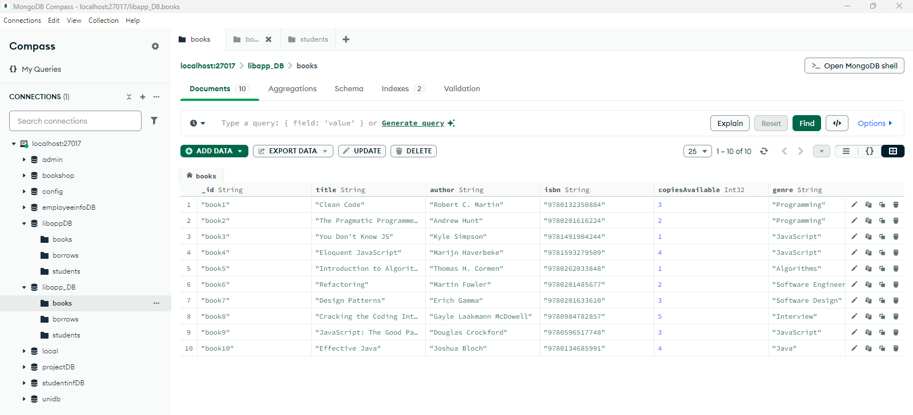 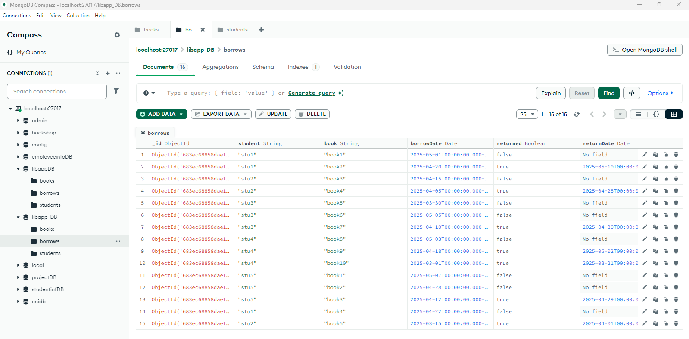 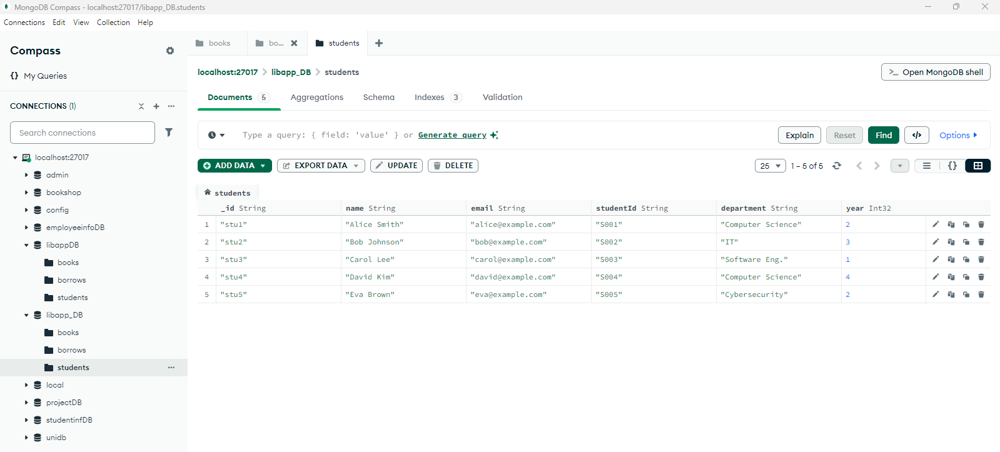 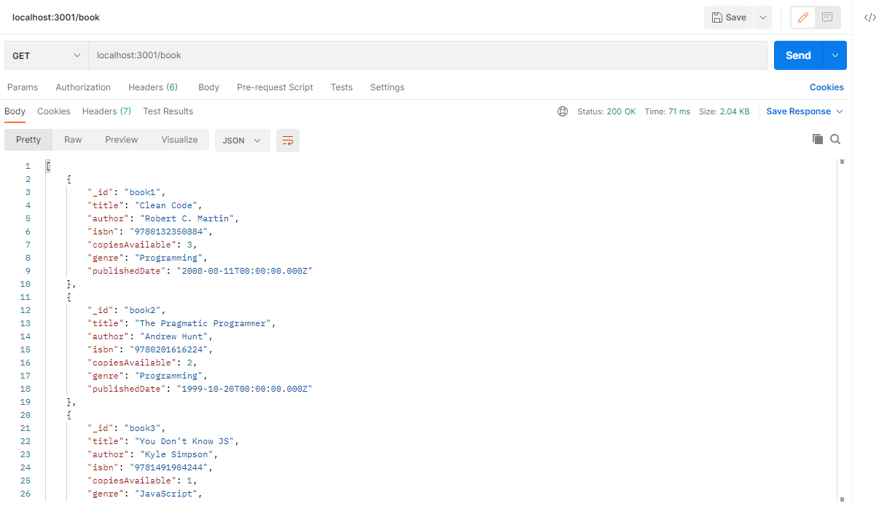 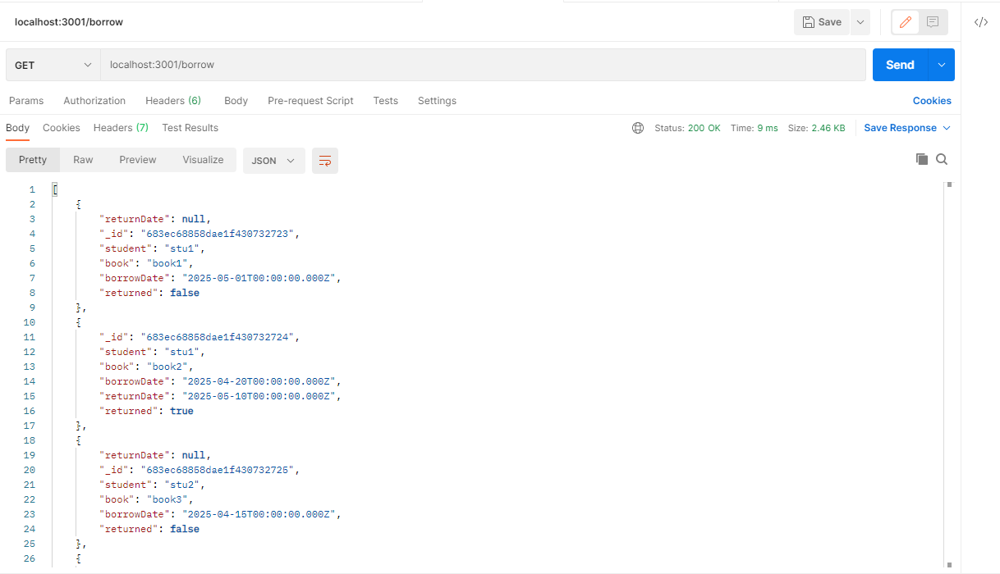 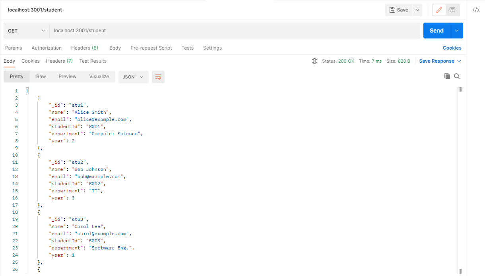
---

### 2️⃣ Filter Books by Genre

- Created an endpoint to get books based on their **genre**

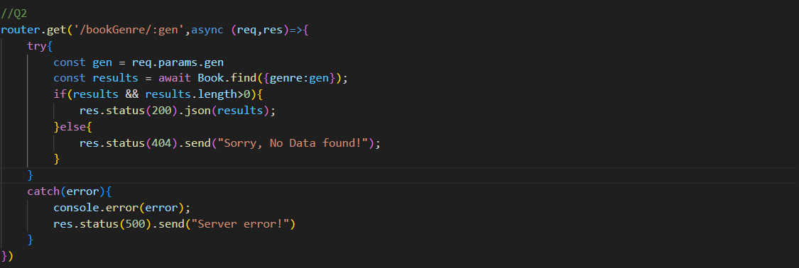 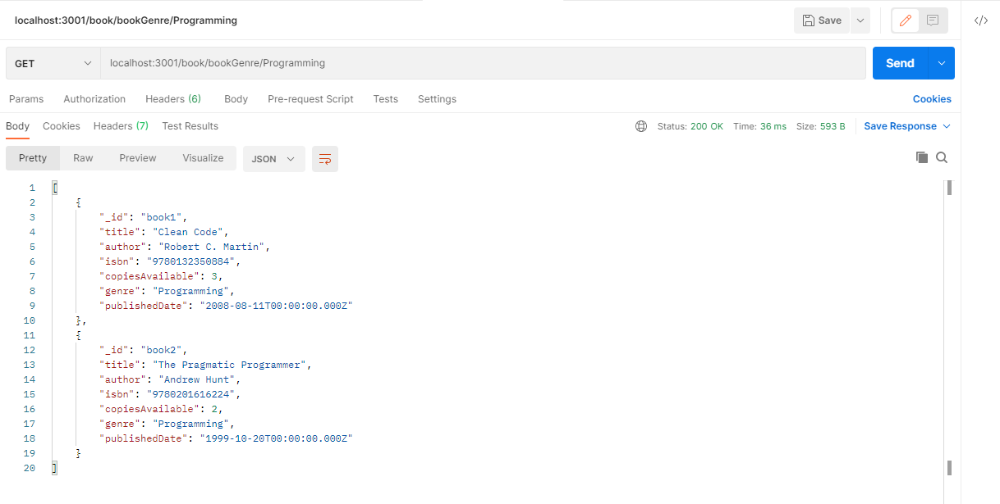 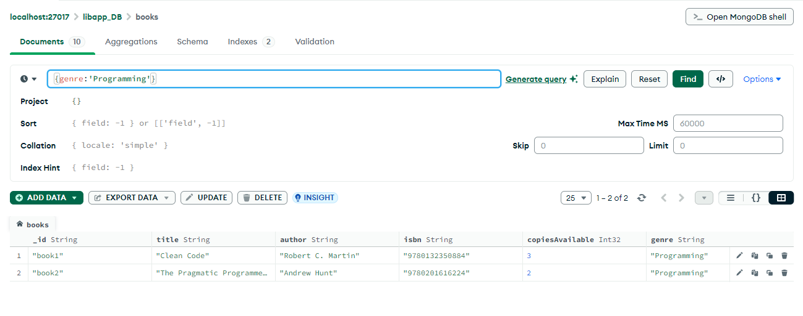
---

### 3️⃣ Filter Students by Year

- Created an endpoint to get students by their **academic year**

 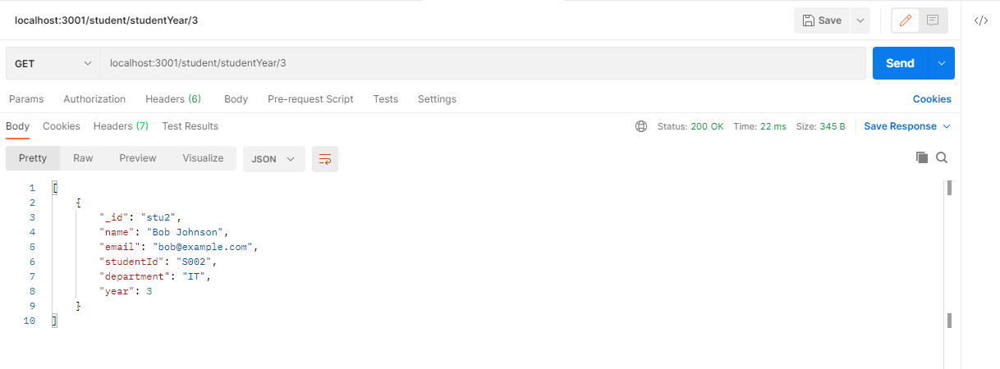 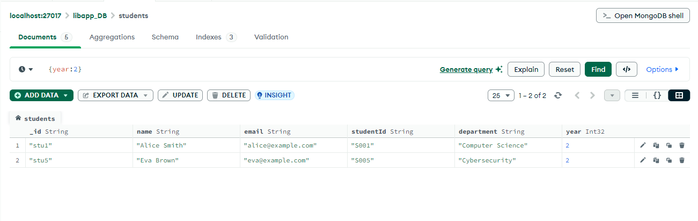
---

### 4️⃣ Common Filtering Function

- Implemented a **reusable filtering function** in a utility or controller
- This avoids repeating code when filtering by genre or year

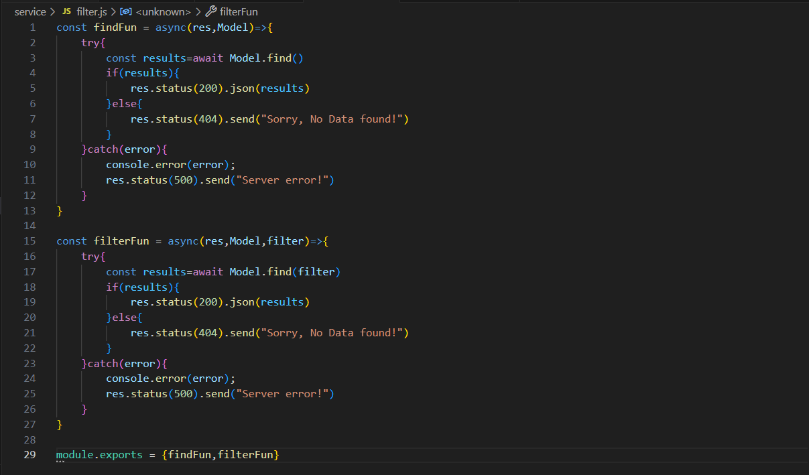 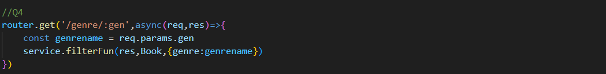 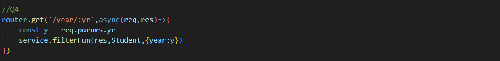 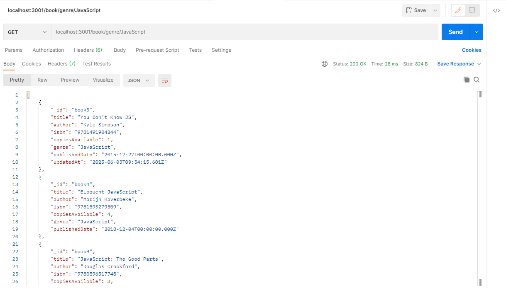 
---

### 5️⃣ Borrow a Book (POST)

Implements borrowing logic with multiple validations:

| Validation | Description |
|------------|-------------|
| ✅ a) ID Check | Student & Book IDs must exist |
| ❌ b) Max Borrow Limit | Students can borrow **max 2 books** at a time |
| ❌ c) Reserve Copy | At least **1 book copy** must remain in library |
| ✅ d) Update Copies | If all checks pass, decrease `copiesAvailable` by 1 |
| ❌ e) Error Handling | Return clear messages if any rule fails |
