---

## 📁 Project Overview: Library Management Backend

This Node.js + Express project is a **library management system** featuring users, books, students, and borrowing operations. It connects to MongoDB and follows a modular structure using Mongoose models and Express routes.

---
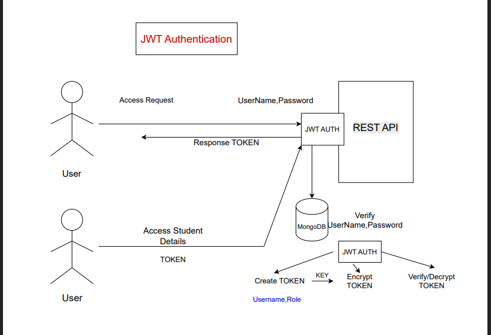
---

### ✅ Highlights

* Uses **JWT for authentication**.
* **Secure password hashing** with bcrypt.
* Clean separation of **models**, **routes**, and **services**.
* Uses **RESTful endpoints** for CRUD operations.

---

### 🔌 `index.js` — *Main Entry Point*

* Initializes the Express app.
* Connects to MongoDB using Mongoose.
* Mounts route files:

  * `/user` → `userRoute.js`
  * `/student` → `studentRoute.js`
  * `/book` → `bookRoute.js`
  * `/borrow` → `borrowRoute.js`

---

## npm install jsonwebtoken
🔐 Helps in creating secure JWT tokens for login sessions

🧠 Used in login logic to generate and verify tokens

📦 Added 12 packages

⚠️ 1 low severity vulnerability (can fix with npm audit fix)

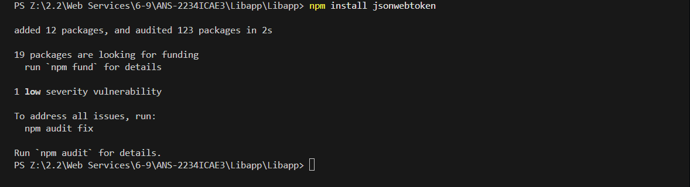
---

## bcrypt Installation
🔑 Used to hash passwords securely before saving to the database

🧪 Used to verify hashed passwords during login

📦 Added 3 packages

⚠️ 1 low severity vulnerability

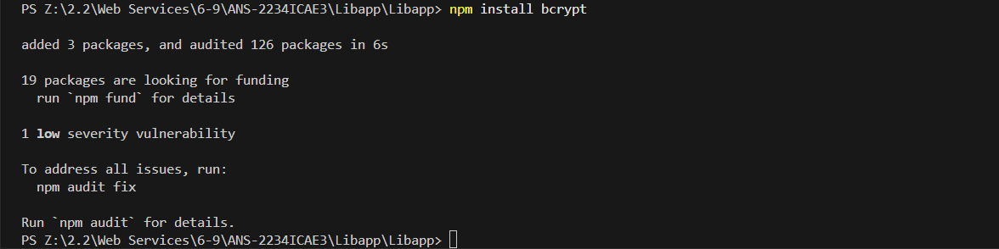
---

### 👤 `userRoute.js` — *User Registration & Login*

* **POST `/register`**: Creates a new user with hashed password (bcrypt).

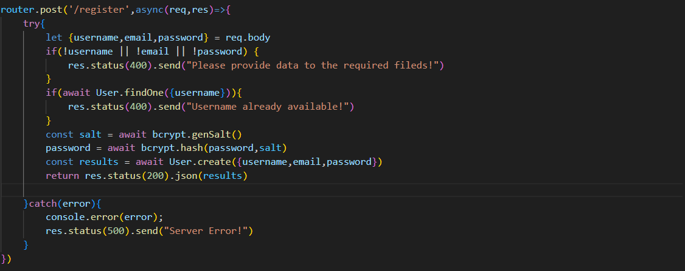 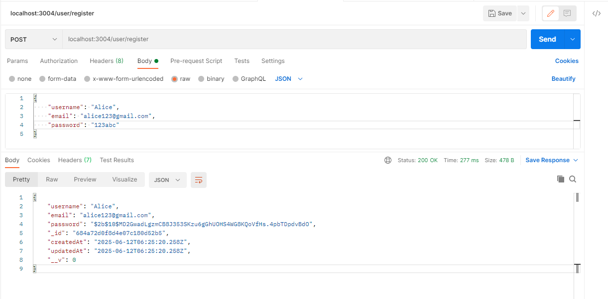 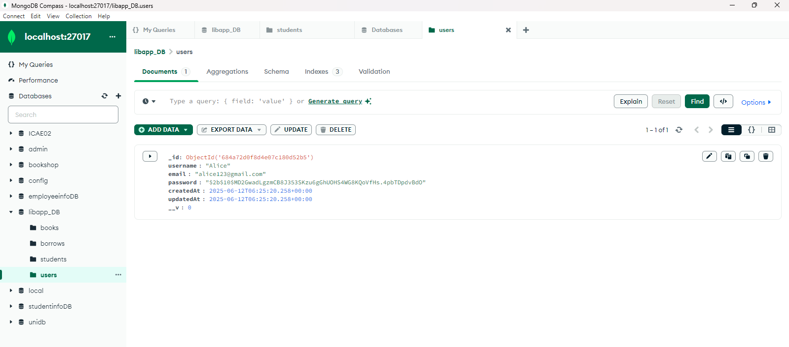 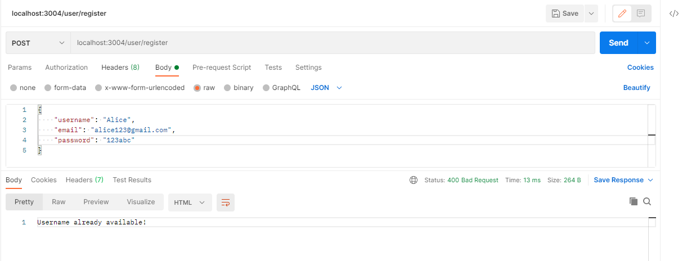
---

* **POST `/login`**: Authenticates user and issues JWT token.

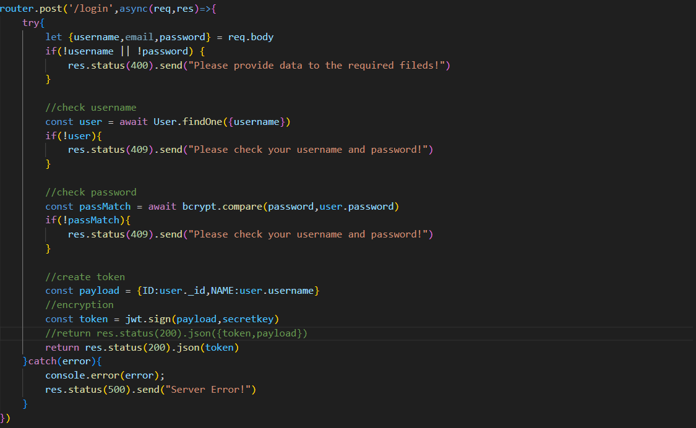 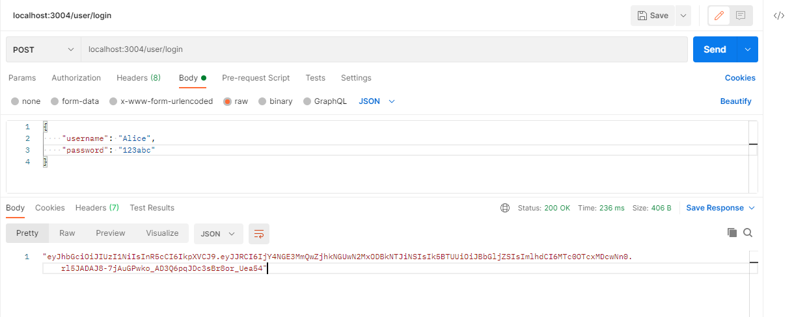 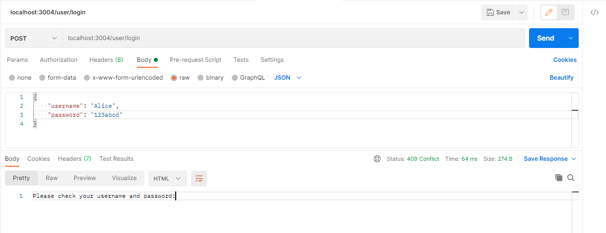
---
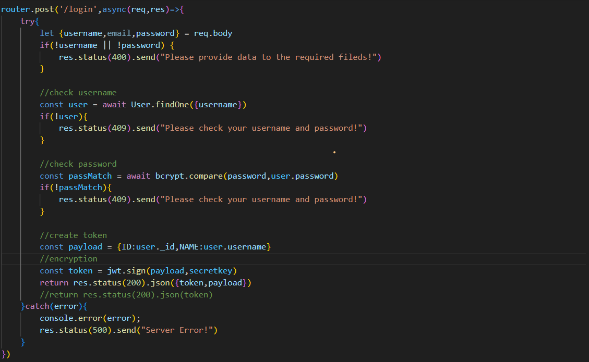 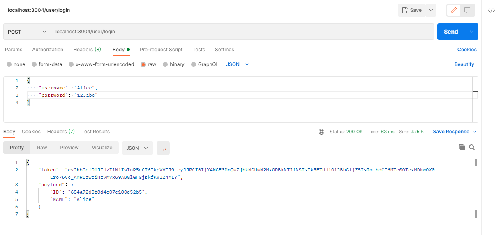 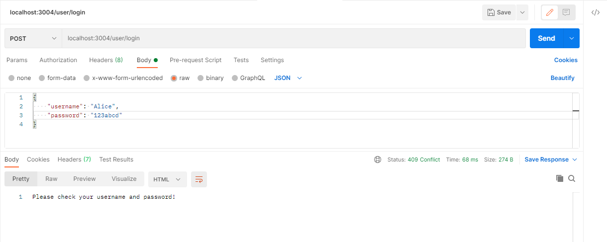
---
* Security is handled with `bcrypt` and `jsonwebtoken`.

---

### 🎓 `studentRoute.js` — *Student Management*

* **POST `/add`**: Adds a new student with name, email, and contact.
* **GET `/getall`**: Retrieves all student records.
* **PUT `/update/:id`**: Updates student details.
* **DELETE `/delete/:id`**: Deletes a student by ID.

---

### 📚 `bookRoute.js` — *Book Management*

* **POST `/add`**: Adds new book (title, author, copies).
* **GET `/getall`**: Retrieves all books.
* **PUT `/update/:id`**: Updates book info.
* **DELETE `/delete/:id`**: Deletes a book.

---

### 🔁 `borrowRoute.js` — *Borrowing System*

* **POST `/add`**: Records a new borrow (student & book).
* **GET `/getall`**: Lists all borrow records.
* **PUT `/update/:id`**: Updates borrow info.
* **DELETE `/delete/:id`**: Deletes borrow record.

---

### 🧠 `genericFindService.js` — *Reusable Search Logic*

* Exports a function to find all records in any Mongoose model.
* Used to reduce code duplication in other routes.

---

### 🧱 Models (in `models/` folder)

* **`User.js`**: Stores `username`, `email`, and hashed `password`.
* **`Student.js`**: Stores `name`, `email`, and `contact`.
* **`Book.js`**: Stores `title`, `author`, and number of copies.
* **`Borrow.js`**: Connects students and books with borrow info.

---
