# 📚 Library Management System

Libapp/  
│   
├── .env                     # Environment variables (secret keys, DB URI)   
├── index.js                 # App entry point   
├── package.json             # Project metadata and dependencies   
├── package-lock.json        # Exact versions of installed packages   
│  
├── middleware/  
│   └── auth.js              # JWT verification middleware  
│  
├── models/  
│   ├── Book.js              # Book schema  
│   ├── Borrow.js            # Borrow history schema  
│   ├── Student.js           # Student user schema  
│   └── User.js              # Common user schema (admin/student)  
│  
├── routes  
│   ├── auth.js              # Login & registration  
│   └── books.js             # CRUD operations for books  
│  
├── controllers/  
│   ├── userController.js    # Auth logic, token generation  
│   └── bookController.js    # Book logic: add, edit, delete, view  
│  
└── utils/                   # Optional helpers  
    ├── hash.js              # Password hashing  
    ├── logger.js            # Logging system (optional)  
    └── validators.js        # Input validation  

## 🔐 Authentication Flow

  [User Login/Register]  
  ⬇️  
  [JWT Token Generated]  
  ⬇️  
  Token added to headers:  
  <code>Authorization: Bearer &lt;token&gt;</code>  
  ⬇️  
  [auth.js Middleware]  
  ⬇️  
  Access to protected routes  

## 🌐 API Endpoints Table

| **Endpoint**          | **Method** | **Description**        | **Auth Required** | **User Role**   |
| --------------------- | ---------- | ---------------------- | ----------------- | --------------- |
| `/api/register`       | `POST`     | Register a new user    | ❌                 | Public          |
| `/api/login`          | `POST`     | User login             | ❌                 | Public          |
| `/api/books`          | `GET`      | Get all books          | ✅                 | Admin / Student |
| `/api/books/:id`      | `GET`      | Get a specific book    | ✅                 | Admin / Student |
| `/api/books`          | `POST`     | Add a new book         | ✅                 | Admin only      |
| `/api/books/:id`      | `PUT`      | Update book details    | ✅                 | Admin only      |
| `/api/books/:id`      | `DELETE`   | Delete a book          | ✅                 | Admin only      |
| `/api/borrow`         | `POST`     | Borrow a book          | ✅                 | Admin / Student |
| `/api/return/:id`     | `PUT`      | Return a borrowed book | ✅                 | Admin / Student |
| `/api/borrow/history` | `GET`      | View borrow history    | ✅                 | Admin / Student |

### 1. `.env`

🔒 **Purpose:** Environment configuration

* MongoDB URI
* JWT Secret
* Server Port

---

### 2. `index.js`

🚀 **Purpose:** Main server entry point

* Initializes Express app
* Connects to MongoDB
* Uses authentication middleware
* Sets up API routes

---

### 3. `package.json`

📦 **Purpose:** Project manifest

* Lists dependencies
* Defines scripts

---

### 4. `middleware/auth.js`

🛡️ **Purpose:** JWT authentication

* Validates tokens
* Protects routes

---

### 5. `models/Book.js`

📚 **Purpose:** Book schema

* title, author, isbn, category, status

---

### 6. `models/Borrow.js`

📄 **Purpose:** Borrow records

* bookId, studentId, borrowDate, returnDate

---

### 7. `models/Student.js`

🎓 **Purpose:** Student schema

* name, email, department, registration number

---

### 8. `models/User.js`

👤 **Purpose:** User schema

* name, email, password (hashed), role

---

### 9. `package-lock.json`

🔗 **Purpose:** Locks dependency versions for consistent installs

---

### 10. `routes/`

🛣️ **Purpose:** API endpoints

* `auth.js`

  * POST /login
  * POST /register
  * Issues JWT tokens

* `books.js`

  * GET /books
  * POST /books
  * PUT /books/\:id
  * DELETE /books/\:id

---

### 11. `controllers/`

🧠 **Purpose:** Business logic separate from routing

* `userController.js` — login/register logic with bcrypt and JWT
* `bookController.js` — book CRUD operations

---

### 12. `utils/` (Optional)

🧰 **Helpful utilities:**

* Password hashing
* Input validation
* Logging

📊 logger.js – Log actions/errors
## 💡 Final Thoughts 
✅ Well-structured backend using the MVC pattern  
✅ Secure JWT authentication system 
✅ Role-based access control 
✅ Easily extendable for future features like pagination, search, notifications, etc.

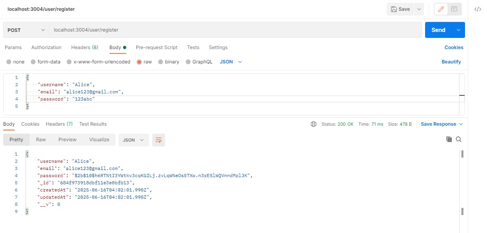
---
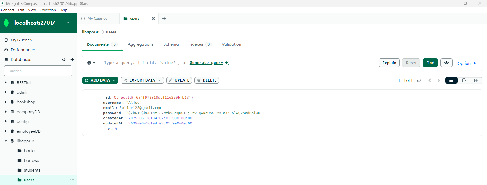  
---
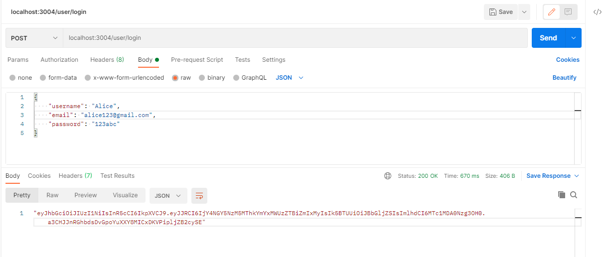  
---
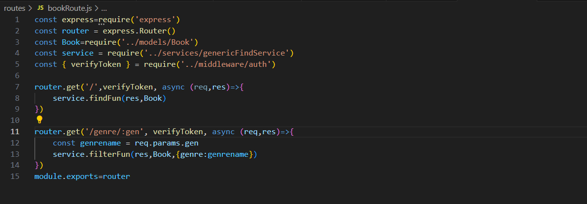  
---
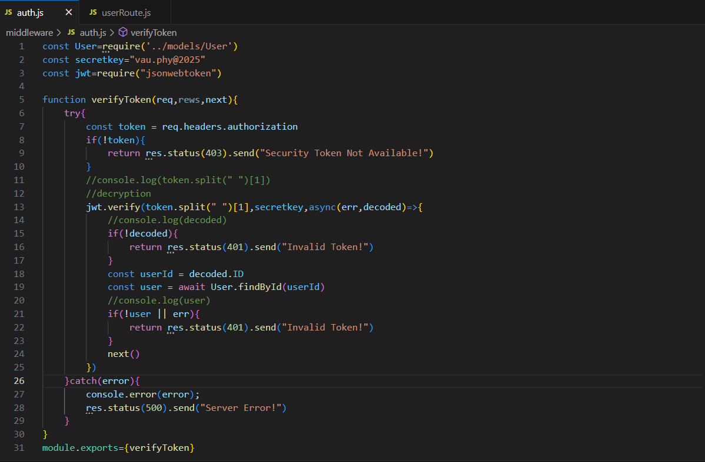  
---
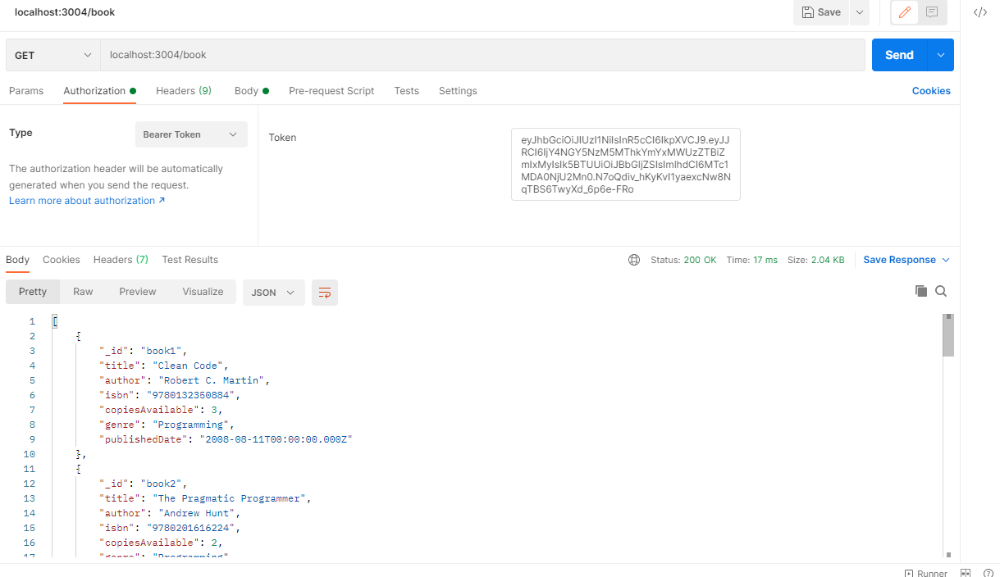  
---
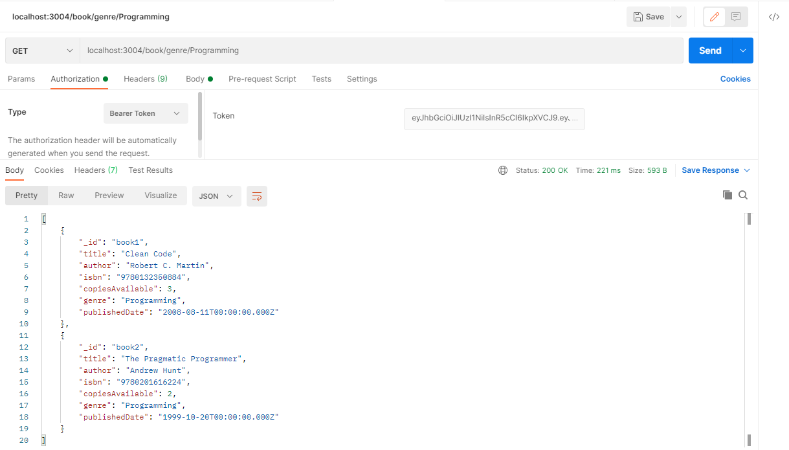  
---
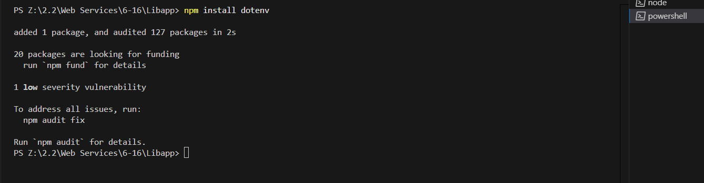  
---
  
---
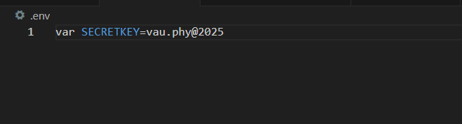  
---
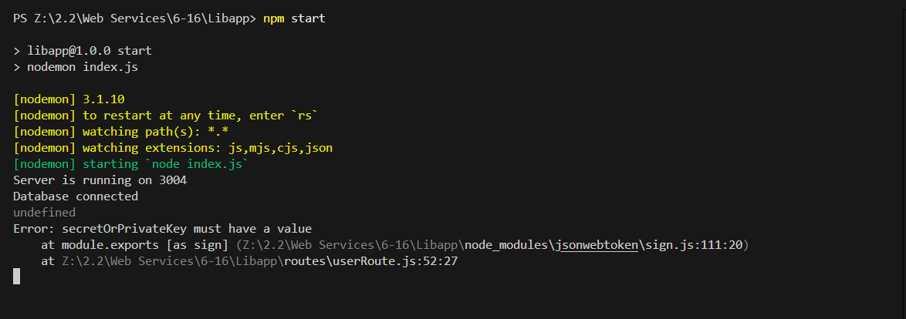 
---
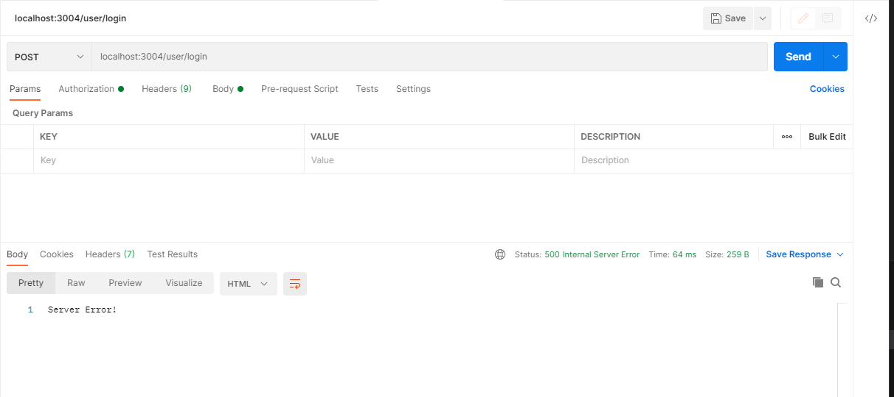  
---
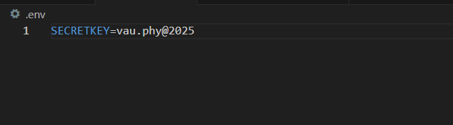  
---
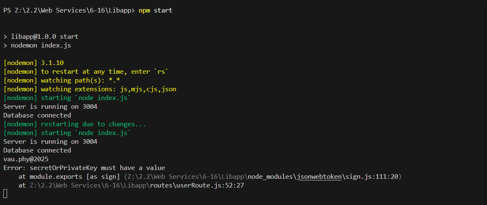  
---
